# CloudPan

**Go + Vue 自托管私有云存储 —— 带完整 Web 桌面外壳（Windows 12 / macOS / Deepin 三主题）的网盘系统**

A self-hosted private cloud drive in **Go + Vue** with a full **web desktop shell** — Windows 12, macOS and Deepin themes.

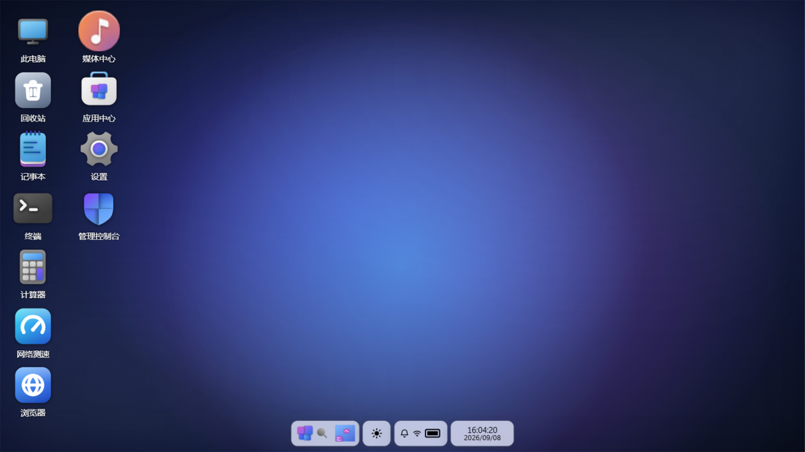

---

## 项目简介

CloudPan 是一个用 **Go（Gin + GORM + SQLite）** 与 **Vue 3 + TypeScript + Vite** 从零实现的私有云存储系统。前端构建产物通过 `go:embed` 嵌入 Go 二进制，**单文件部署**，无 Docker 依赖。

它的最大特色是**完整的 Web 桌面外壳**：打开浏览器就像开了一台电脑——BIOS 风格开机动画、系统登录页、可拖拽/缩放/贴边的窗口、开始菜单 / Launchpad / 启动器、任务栏 / Dock、全局搜索、控制中心……并且内置 **三套可切换的操作系统主题**：

| Windows 12 概念版风格 | macOS（对标 Sonoma） | Deepin（对标 DDE 25） |
|---|---|---|
|  |  |  |

桌面内置 16 个应用：文件资源管理器、此电脑、回收站、记事本、终端、计算器、网络测速、**内置浏览器**、图片查看器、媒体播放器、Office 编辑器、媒体中心、来自他人的共享、应用中心、设置、管理控制台。

网盘核心功能对齐主流网盘：分块上传 + 断点续传 + SHA-256 秒传、分享链接（提取码/有效期/次数）、回收站、压缩解压、离线下载（服务器代下 + SSRF 防护）、WebDAV、ONLYOFFICE 在线编辑、多用户/用户组/配额/审计日志。存储层采用**驱动注册表架构**（借鉴 Cloudreve 设计），本地目录与 123 云盘 / 阿里云盘 / 百度网盘 / 天翼云盘（实验性）即插即用。

## Project Overview

CloudPan is a private cloud storage system built from scratch with **Go (Gin + GORM + SQLite)** and **Vue 3 + TypeScript + Vite**. The frontend is embedded into the Go binary via `go:embed` — **single-file deployment**, no Docker required.

Its standout feature is a **complete web desktop shell**: opening the browser feels like booting a computer — BIOS-style boot animation, system login, draggable/resizable/snappable windows, Start menu / Launchpad / full-screen launcher, taskbar / Dock, global search, control center — with **three switchable OS themes**:

| Windows 12 (concept style) | macOS (Sonoma-style) | Deepin (DDE 25-style) |
|---|---|---|
|  |  |  |

The desktop ships 16 built-in apps: File Explorer, This PC, Recycle Bin, Notepad, Terminal, Calculator, Network Speed Test, a **built-in browser** (server-side proxied), Image Viewer, Media Player, Office Editor, Media Center, Shared with Me, App Center, Settings, and an Admin Console.

The storage core matches mainstream cloud drives: chunked upload with resume + SHA-256 instant upload, share links (access code / expiry / download count), recycle bin, zip compression/extraction, offline download (server-side fetch with SSRF protection), WebDAV, ONLYOFFICE online editing, multi-user / user groups / quotas / audit log. The storage layer uses a **driver registry architecture** (inspired by Cloudreve): local directories plus 123Pan / Aliyun Drive / Baidu Wangpan / Tianyi Cloud (experimental) plug in and out.

---

## 截图 Screenshots

### Windows 12 主题

| 登录 | 桌面 | 开始菜单 |
|---|---|---|
|  |  | 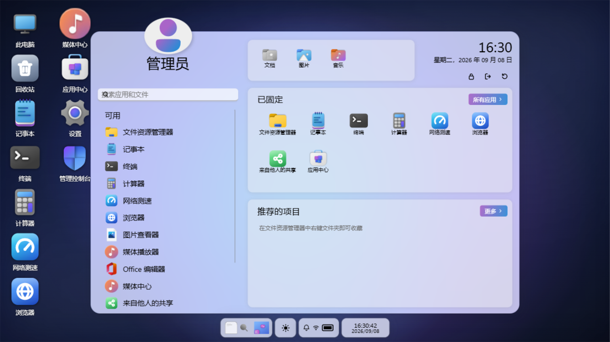 |

| 全局搜索（分类筛选） | 小组件 | 控制中心 |
|---|---|---|
|  |  |  |

| 此电脑 | 文件资源管理器（C:\图片） | 内置浏览器（经服务端代理访问百度） |
|---|---|---|
| 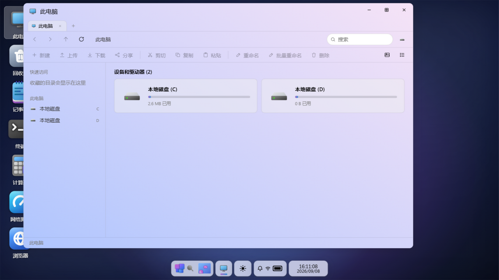 |  | 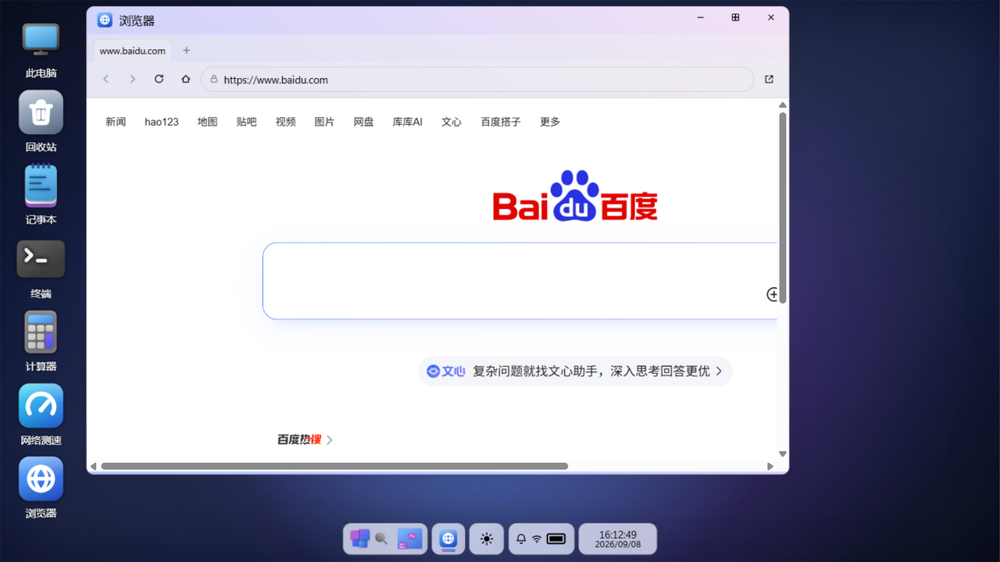 |

| 设置（三主题 + 壁纸 + 深色模式） | 深色登录 | 深色桌面 |
|---|---|---|
| 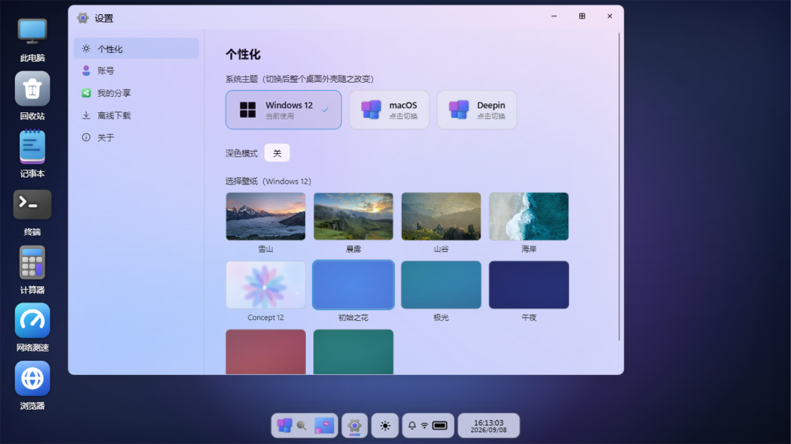 | 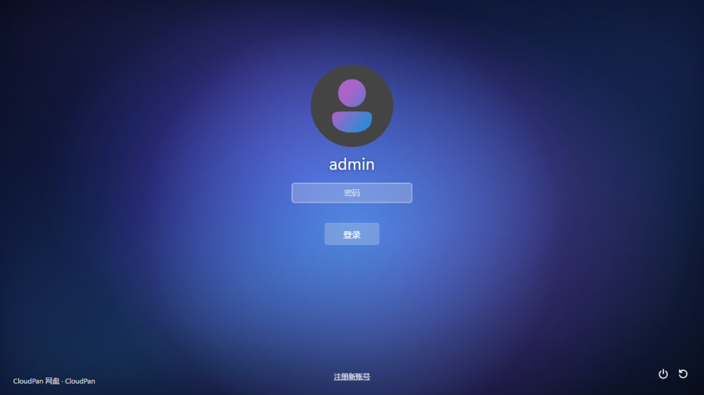 | 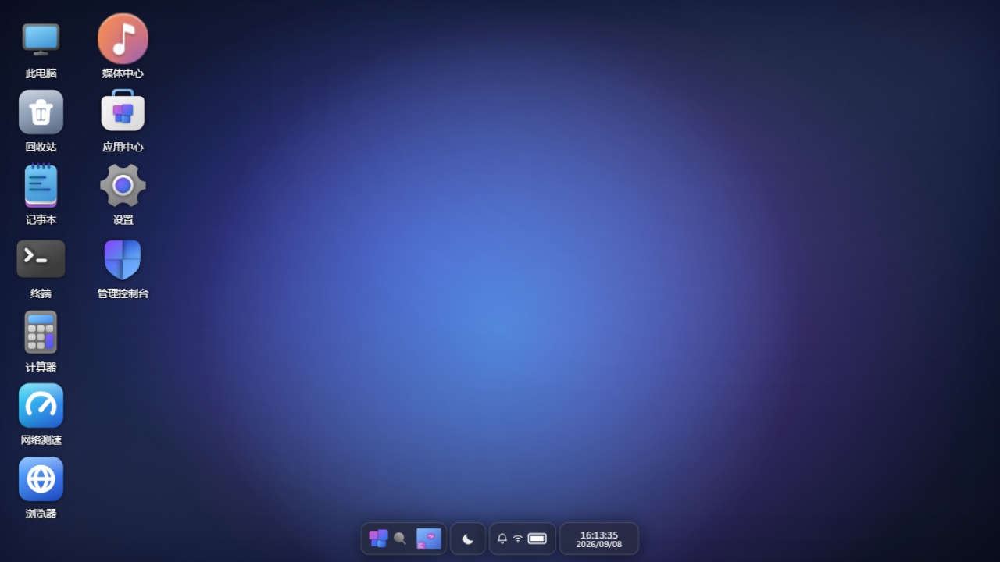 |

### macOS 主题

| 登录 | 桌面（菜单栏 + 放大 Dock） | Launchpad |
|---|---|---|
| 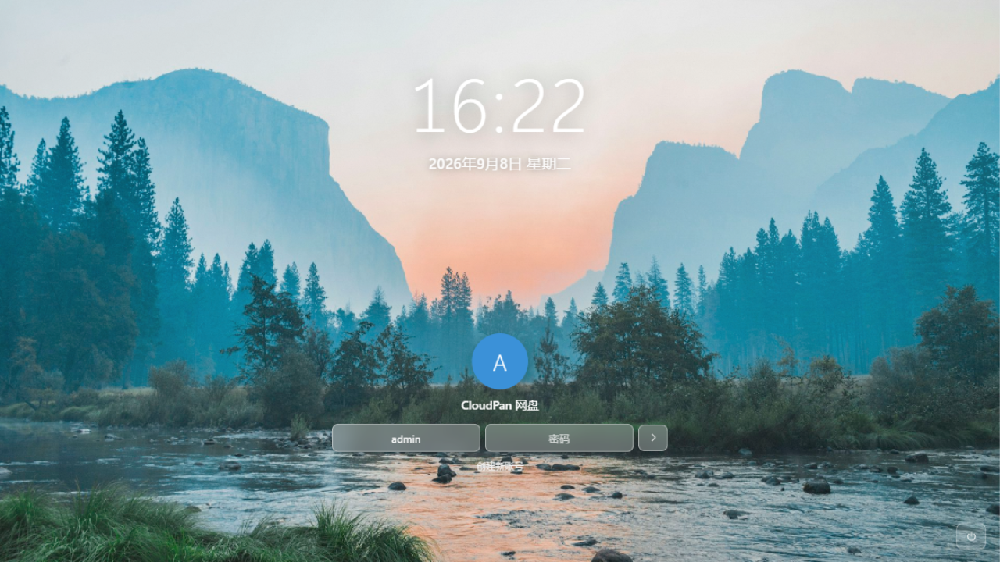 |  |  |

| 文件管理器窗口（红绿灯） | 深色桌面 | 深色内置浏览器 |
|---|---|---|
|  |  | 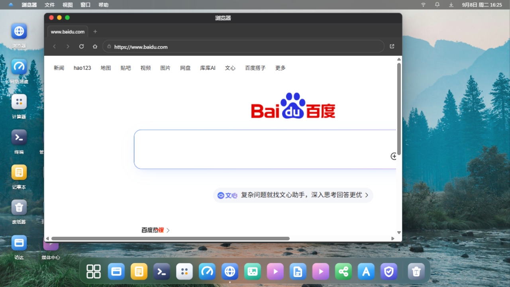 |

### Deepin 主题

| 登录 | 桌面（DDE 25 全宽任务栏） | 全屏启动器 |
|---|---|---|
| 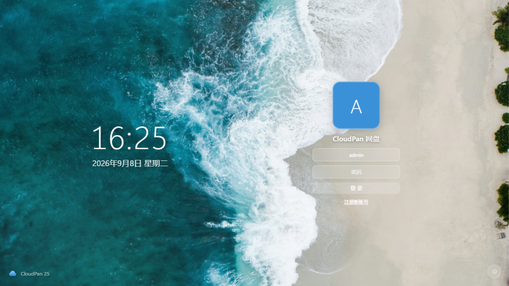 |  | 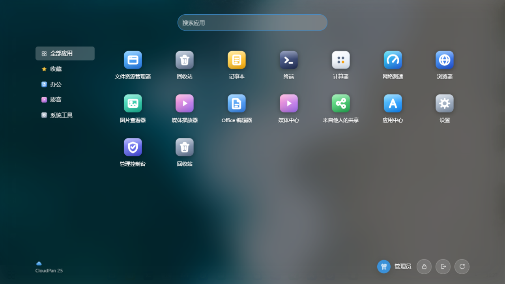 |

| 此电脑窗口 | 深色登录 | 深色启动器 |
|---|---|---|
| 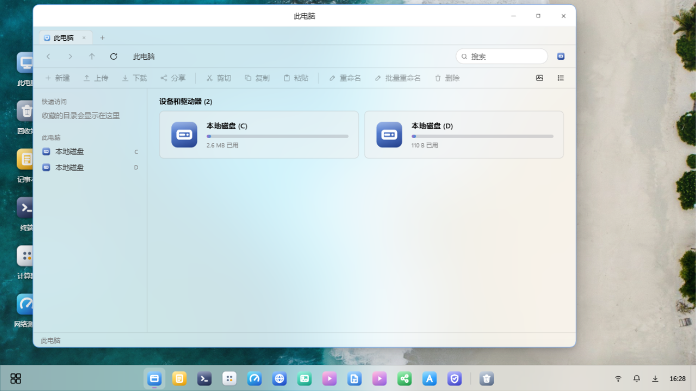 |  | 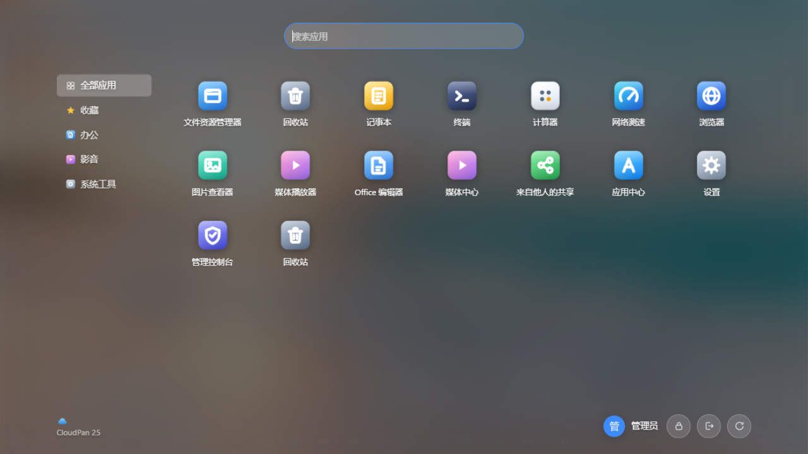 |

| 深色桌面 |
|---|
|  |

---

## 功能特性

**桌面外壳（三主题共享架构，`themes/` 插件包）**
- 开机动画 → 登录 → 桌面全流程；注册/锁屏；管理员与普通用户
- 窗口管理器：拖拽、8 向缩放、最大化、贴边分屏、最小化飞行动画、多标签资源管理器
- Windows 12：BIOS 开机 + 花朵加载、**悬浮多段胶囊 Dock**（开始/搜索/小组件/日-夜主题切换/控制中心/日期胶囊）、双栏开始菜单（应用列表 + 已固定 + 推荐收藏 + 电源区）、全局搜索面板（全部/应用/文档/网页/设置/文件夹/照片 分类，网页结果直达内置浏览器、设置分类深链到对应页）、控制中心（网速/通知/传输/护眼/深色/锁定 + 亮度）、时间小组件
- macOS：顶部菜单栏（应用菜单 + 系统托盘）、**高斯放大 Dock**（启动弹跳）、Launchpad（搜索 + 分类）、红绿灯窗口、无卡片式登录（大时钟 + 头像 + 胶囊输入）
- Deepin（DDE 25）：底部 48px 全宽任务栏（左启动器 / 中应用 / 右托盘 + 显示桌面）、**全屏启动器**（分类导航 + 搜索 + 电源区）、40px 居中标题栏、登录双栏
- 每主题 9 张壁纸（4 张 Unsplash 免费授权照片 + 5 套 CSS 渐变）+ 深色模式，设置里一键切换
- 全局右键菜单、通知中心（未读角标 + 软清除）、传输浮窗（多任务并发、暂停/继续/取消）

**网盘核心**
- 存储策略抽象（借鉴 Cloudreve 设计）：本地目录 + 123 云盘 + 阿里云盘 + 百度网盘（默认只读）+ 天翼云盘（实验性），驱动注册表架构，新后端即插即用；管理控制台挂载 + 测通 + OAuth 授权
- 文件管理：新建/重命名/移动/复制/删除（入回收站）/搜索（本盘/全局）/属性/收藏快速访问；网格与列表双视图；完整右键菜单
- 上传：**分块上传 + 断点续传 + SHA-256 秒传**（哈希索引去重）
- 下载：单文件直下、多选/目录 zip 打包流式下载；图片/视频/音频 Range 流式预览
- 分享：提取码/有效期/剩余下载次数/预览开关/浏览下载计数，公开分享页
- 回收站：还原 / 彻底删除 / 清空，删除自动计入用户用量
- 压缩解压：右键压缩为 zip / 解压到当前目录（含子目录安全校验）
- 离线下载：HTTP(S) 链接服务器代下载入网盘，DB 任务队列重启自动恢复，**SSRF 三层防护**
- WebDAV：`/dav/{用户名}/{盘符}/`，独立应用密码，可挂载进 Windows 资源管理器/手机
- ONLYOFFICE 在线编辑（未配置时自动回退内置编辑器：xlsx 可编辑表格 / docx 预览 / PDF 预览）

**终端（真实 shell）**
- 本地终端：服务端 PTY（Linux pty / Windows ConPTY，`creack/pty`）启动真实 shell，xterm.js + WebSocket 二进制透传，完整 TUI（vim/htop 均可用）；shell 白名单（Linux: bash/sh/zsh/fish，Windows: cmd/PowerShell），工具栏可切换
- 远程 SSH 终端：保存多个连接（密码 / 私钥，凭证 AES-256-GCM 加密落库，API 永不回显），`x/crypto/ssh` 拨号 + PTY 协商；主机密钥 **TOFU**（首次信任、变更即拒绝）；目标地址安全校验（拒绝 169.254/16 云元数据、0.0.0.0/8、组播/保留段，域名解析后逐 IP 复检）；测通接口返回延迟与远端系统信息
- **SFTP 文件管理面板**（SSH 模式）：面包屑浏览、上传（选择/拖拽，逐文件进度条）、下载（中文文件名 RFC5987）、新建/重命名/删除（目录递归）、连接池复用 + 空闲清扫
- 并发限制：每用户 4 本地 / 8 SSH 会话，全局 32；连接/文件操作全量审计日志；受「终端」系统功能门控（应用中心可停）

**内置浏览器（特色功能）**
- 桌面内置浏览器应用：多标签（每页独立沙箱 iframe）、地址栏（裸域名自动补 https、非 URL 当百度搜索词）、前进/后退/刷新/主页、快捷入口、"在系统浏览器中打开"兜底
- **服务端代理**绕过站点 X-Frame-Options/CSP frame-ancestors 的嵌入限制：HTML 自动重写 src/href/action/poster/srcset/meta-refresh 为代理路径、剥离站点 `<base>` 与 CSP、注入代理 base 兜底、gbk/big5/utf-16/latin1 转 UTF-8；非 HTML 资源透传（128MB 上限、300s 缓存）
- 安全设计：短时效 HMAC 代理票据（`pt`，30 分钟，非真实 JWT）；iframe 沙箱**故意不带 allow-same-origin**（站点 JS 读不到网盘登录态）；复用离线下载的 SSRF 三层防线（URL 校验 + 重定向复检 + 拨号层 DNS 复检）；每 IP 300 次/分钟限速；访问日志凭证脱敏

**多用户体系**
- 角色（admin/user）+ 用户组（配额、功能白名单：分享/WebDAV/压缩/离线/浏览器/应用中心、分享可下载、限速、可用存储策略白名单）
- **用户数据隔离**：本地存储策略按用户划分独立目录（`<策略根目录>/<用户目录名>/`，如 `C:/admin`、`C:/johngko`），每个用户在网页/WebDAV/分享/离线下载/版本恢复看到的都是自己目录下的虚拟根，互相不可见；目录名取安全 ASCII 用户名（其余取 `user_<id>`）并首次固化到 `UserSetting(local_dir)`，改用户名不影响已有数据。云盘策略不隔离（后端账号本身即边界）
- 站点设置：站点名、注册开关、邀请码、公告；审计日志（登录/文件操作/分享/管理动作/通知）
- 登录：Win12 登录页用户名框常显（预填 admin，注册用户可清空输入自己的账号）；开放注册后新用户即可登录并使用自己的隔离空间

**内置应用（16）**
文件资源管理器 / 此电脑 / 回收站 / 记事本（读写网盘文本）/ **终端**（本地真实 shell + 远程 SSH 终端，xterm.js 完整 TUI；SSH 模式带 SFTP 文件管理面板：浏览/上传/下载/新建/重命名/删除，支持拖拽上传）/ 计算器 / **网络测速**（界面仿 LibreSpeed，随机数据端点不可压缩防虚高）/ **内置浏览器** / 图片查看器（缩放旋转 + EXIF/GPS）/ 媒体播放器（视频 + 音频 + 歌词字幕，封面取自 ID3）/ Office 编辑器 / 媒体中心（可安装应用）/ 来自他人的共享 / 应用中心 / 设置（壁纸主题/账号/WebDAV 密码/我的分享/离线下载）/ 管理控制台（仪表盘/用户/用户组/存储策略与云盘授权/站点设置/审计日志）

---

## 快速开始

```bat
:: Windows（需已安装 Go 1.22+ 与 Node.js 18+）
build.bat      :: 构建前端并嵌入，产出 server\cloudpan.exe
start.bat      :: 启动，浏览器访问 http://localhost:18322
```

```bash
# Linux / macOS
./build.sh && ./server/cloudpan
```

- 默认管理员：`admin / admin123`（**登录后请立即在 设置 → 账号 修改密码**）
- 数据目录：`server/data/`（SQLite 数据库、回收站、缩略图、上传临时区、密钥），可用环境变量 `CP_DATA` 重定向
- 端口：默认 `18322`，`CP_PORT` 修改；对外可达地址用 `CP_PUBLIC_URL` 配置（ONLYOFFICE 集成需要）
- 首次使用：管理员登录 → 管理控制台 → 存储策略 → 挂载一个本地目录为磁盘（如把某目录挂载为 C 盘），桌面"此电脑"即出现该盘

**开发模式**

```bash
cd web && npm install && npm run dev   # Vite 5173，/api 代理到 18322
cd server && go run .                  # 后端
```

## Quick Start

```bat
:: Windows (requires Go 1.22+ and Node.js 18+ installed)
build.bat      :: builds the frontend, embeds it, produces server\cloudpan.exe
start.bat      :: starts the server, open http://localhost:18322
```

```bash
# Linux / macOS
./build.sh && ./server/cloudpan
```

- Default admin: `admin / admin123` (**change it immediately in Settings → Account after first login**)
- Data directory: `server/data/` (SQLite DB, recycle bin, thumbnails, upload temp, secret key); override with `CP_DATA`
- Port: default `18322`, override with `CP_PORT`; public URL (needed by ONLYOFFICE) via `CP_PUBLIC_URL`
- First run: log in as admin → Admin Console → Storage Policies → mount a local directory as a disk (e.g. C:), which then shows up under This PC on the desktop

**Development mode**

```bash
cd web && npm install && npm run dev   # Vite on 5173, /api proxied to 18322
cd server && go run .                  # backend
```

---

## 目录结构

```
cloudpan/
├── build.bat / build.sh / start.bat   # 构建 & 启动脚本
├── docs/screenshots/                  # README 截图
├── server/                            # Go 后端（单二进制，embed 前端）
│   ├── main.go
│   └── internal/
│       ├── config/  model/  dto/      # 配置 / 全量表结构 / 统一响应
│       ├── fscore/                    # 存储驱动接口+注册表、路径安全、分块上传、秒传、zip、SSRF
│       ├── driver/                    # 123 / 阿里 / 百度 / 天翼 云盘驱动
│       ├── handler/                   # auth/fs/upload/share/recycle/admin/office/webdav/browser/tasks
│       └── web/                       # go:embed 前端产物
└── web/                               # Vue 3 + TS + Vite 前端
    └── src/
        ├── shell/                     # ShellHost 路由壳 / 分享页
        ├── themes/                    # 三套 OS 主题包（windows / macos / deepin，插件式）
        ├── apps/                      # 16 个内置应用
        ├── stores/                    # session / windows / apps / ui / transfer (Pinia)
        └── api/                       # axios 封装与各模块 API
```

## Repository Layout

```
cloudpan/
├── build.bat / build.sh / start.bat   # build & launch scripts
├── docs/screenshots/                  # README screenshots
├── server/                            # Go backend (single binary, embedded frontend)
│   ├── main.go
│   └── internal/
│       ├── config/  model/  dto/      # config / table models / unified responses
│       ├── fscore/                    # storage driver interface+registry, path safety, chunked upload, dedup, zip, SSRF guard
│       ├── driver/                    # 123Pan / Aliyun / Baidu / Tianyi cloud drivers
│       ├── handler/                   # auth/fs/upload/share/recycle/admin/office/webdav/browser/tasks
│       └── web/                       # go:embed frontend build output
└── web/                               # Vue 3 + TS + Vite frontend
    └── src/
        ├── shell/                     # ShellHost router shell / share page
        ├── themes/                    # three OS theme packages (windows / macos / deepin, pluggable)
        ├── apps/                      # 16 built-in applications
        ├── stores/                    # session / windows / apps / ui / transfer (Pinia)
        └── api/                       # axios wrapper and per-module APIs
```

---

## 部署加固

**HTTPS（推荐 Caddy 自动签证书）**

```
pan.你的域名.com {
    reverse_proxy 127.0.0.1:18322
}
```

Nginx 参考：`location / { proxy_pass http://127.0.0.1:18322; proxy_set_header Host $host; client_max_body_size 0; }`（`client_max_body_size 0` 解除上传大小限制）。启用 HTTPS 后把 `CP_PUBLIC_URL` 设为 https 地址（ONLYOFFICE 集成要求两侧同协议）。

**开机自启**
- Windows 服务（NSSM）：`nssm install CloudPan E:\cloudpan\server\cloudpan.exe` + `AppEnvironmentExtra CP_PORT=18322 CP_DATA=E:\cloudpan\server\data`
- Linux systemd：`[Service] WorkingDirectory=/opt/cloudpan/server; ExecStart=/opt/cloudpan/server/cloudpan; Restart=always`

**安全说明**
- 登录防爆破：同 IP+用户名 15 分钟内失败 5 次锁定（Web 登录与 WebDAV 共用同一锁定表）；登录接口 IP 限速（10 次/分钟）
- **客户端 IP 信任边界**：默认**不信任任何** `X-Forwarded-For`（直接取 TCP 对端地址），攻击者无法伪造 XFF 头绕过上述按 IP 的限速/锁定。部署在反向代理（Caddy/Nginx）之后时，用环境变量 `CP_TRUSTED_PROXIES` 显式声明代理网段（逗号分隔 CIDR/IP，如 `127.0.0.1` 或 `10.0.0.0/8`），系统才会从 XFF 链中还原真实客户端 IP
- **终端默认仅管理员可用**：应用清单中终端默认关闭，且默认用户组权限禁用终端（存量部署启动时自动补上，尊重已显式配置）；普通用户即便拿到会话也无法调用任何 `/terminal/*` 端点。如需放行，在应用中心开启并给用户组/个人授权。终端以服务器进程用户身份执行命令（如以 root 启动即 root 权限），请仅部署在受信任环境，或用独立低权限账号运行
- 修改/重置密码后该用户**全部旧 JWT 立即失效**（令牌版本号校验）；禁用账号与密码错误返回一致提示（防用户名枚举）
- 在线 Office 回调拉取**钉扎到配置的 Document Server 同源地址**（scheme + host 白名单），防止回调被利用发起 SSRF
- 磁力链显式 tracker（tr=）与 HTTP 直链/种子同过 SSRF 校验（内网/保留段拒绝）；BT/磁力需独立功能权限
- 分享提取码验证按 IP 限速（防爆破密码分享）；只读用户组的 WebDAV 一律拒绝写操作
- **html/htm/xhtml/svg 一律强制下载**（`attachment`），不以内联方式直接响应，杜绝存储型 XSS 在站内域执行；xlsx 预览 HTML 经 DOM 白名单净化
- CSP 收紧：移除 `unsafe-eval` 与 `script/style/connect/frame` 的 `https:` 通配，仅按配置精确放行 ONLYOFFICE Document Server 来源
- **首次部署管理员密码随机生成**，仅在启动日志打印一次（不落任何文件），登录请立即修改
- SSH 连接凭证 AES-256-GCM 加密存储（密钥 = 服务器 secret.key）；主机密钥 TOFU 防中间人；目标地址拒绝云元数据/保留段
- 直链/预览支持 `?t=令牌` 查询参数（img/video/a 标签无法携带请求头），令牌即登录 JWT，生产环境建议全程 HTTPS
- 访问日志自动脱敏（`t`/`token`/`st`/`pt` 参数）
- 离线下载与内置浏览器代理均过 SSRF 三层防护（URL 校验 + 重定向复检 + 拨号层 DNS 复检），环回/链路本地/ftp 一律拒绝
- 资源硬上限：离线下载 / BT 种子 / 归档解压 / 上传分片均有总量与条目数上限（防 zip-bomb 与磁盘拖爆）
- 上传分片临时区每 6 小时自动清扫（结束/超时 48h 的会话）
- 建议定期备份 `server/data/cloudpan.db`

## Deployment & Hardening

**HTTPS (Caddy recommended, auto-issued certs)**

```
pan.your-domain.com {
    reverse_proxy 127.0.0.1:18322
}
```

Nginx: `location / { proxy_pass http://127.0.0.1:18322; proxy_set_header Host $host; client_max_body_size 0; }` (`client_max_body_size 0` lifts the upload size limit). Once on HTTPS, set `CP_PUBLIC_URL` to the https URL (required for ONLYOFFICE; both sides must share the same scheme).

**Auto-start**
- Windows service (NSSM): `nssm install CloudPan E:\cloudpan\server\cloudpan.exe` + `AppEnvironmentExtra CP_PORT=18322 CP_DATA=E:\cloudpan\server\data`
- Linux systemd: `[Service] WorkingDirectory=/opt/cloudpan/server; ExecStart=/opt/cloudpan/server/cloudpan; Restart=always`

**Security notes**
- Login brute-force protection: 5 failures within 15 minutes for the same IP+username locks the account (Web login and WebDAV share the same lockout table); login endpoint rate-limited per IP (10/min)
- **Client-IP trust boundary**: **no `X-Forwarded-For` is trusted by default** (the TCP peer address is used), so attackers cannot spoof XFF to bypass the per-IP rate limits/lockouts. When deployed behind a reverse proxy (Caddy/Nginx), declare the proxy CIDRs via the `CP_TRUSTED_PROXIES` env var (comma-separated CIDR/IP, e.g. `127.0.0.1` or `10.0.0.0/8`) and the real client IP will be restored from the XFF chain
- **Terminal is admin-only by default**: the terminal app is disabled in the app manifest and blocked for the default user group (existing deployments get the flag backfilled on boot; explicit configs are respected); regular users cannot call any `/terminal/*` endpoint even with a valid session. To grant access, enable the app in the App Center and authorize the group/user. Note the terminal executes commands as the server process user (root if started as root) — run in trusted environments only, or under a dedicated low-privilege account
- Changing/resetting a password **invalidates all of that user's JWTs immediately** (token version check); disabling an account and wrong password return the same message (username-enumeration safe)
- ONLYOFFICE save-callback fetches are **pinned to the configured Document Server origin** (scheme + host allowlist) to prevent callback-driven SSRF
- Magnet trackers (tr=) and plain-HTTP seeds pass the same SSRF validation (intranet/reserved ranges rejected); BT/magnet requires its own feature permission
- Share extraction-code verification is rate-limited per IP (no brute-forcing password-protected shares); read-only groups are refused all WebDAV mutating methods
- **html/htm/xhtml/svg are always served as `attachment`** (never inline), closing stored XSS execution on the site origin; xlsx preview HTML is DOM-sanitized against a tag/attribute allowlist
- CSP tightened: `unsafe-eval` and all `https:` wildcards on script/style/connect/frame removed; only the configured ONLYOFFICE Document Server origin is allowed (resolved dynamically, 10s cache)
- **First-deploy admin password is random**, printed once to the startup log only (never persisted) — change it at first login
- SSH connection credentials stored AES-256-GCM encrypted (key = server secret.key); host-key TOFU; target addresses reject cloud metadata/reserved ranges
- Direct links/previews accept `?t=<jwt>` query params (img/video/a tags cannot carry headers); the token IS the login JWT — serve over HTTPS in production
- Access log auto-redacts credentials (`t`/`token`/`st`/`pt` params)
- Offline download and the built-in browser proxy both pass the 3-layer SSRF guard (URL validation + redirect re-check + dialer-level DNS re-check); loopback/link-local/ftp always rejected
- Hard resource caps on offline download / BT torrents / archive extraction / chunked upload (total bytes + entry counts, anti zip-bomb and disk exhaustion)
- Chunked-upload temp area auto-swept every 6 hours (sessions finished/expired >48h)
- Back up `server/data/cloudpan.db` regularly

---

## 云盘接入与扫码绑定教程

支持的云盘：**123云盘**（官方开放平台）、**阿里云盘**（开放平台 OAuth）、**百度网盘**（官方 API，OAuth）、**天翼云盘**（Cookie，实验性）。
阿里云盘 / 百度网盘支持**手机扫二维码一键绑定**（参考 AList 的挂载体验）：管理台把厂商授权页渲染成二维码，手机扫码→登录确认→厂商重定向回系统回调接口→token 自动落库，全程无需复制粘贴。

### 通用前置：配置「公开地址」

扫码绑定依赖厂商把手机浏览器重定向回本系统（`<公开地址>/api/cloud/callback`），因此**手机必须能访问该地址**：

1. 管理控制台 → 站点设置 → **公开地址**，填写手机可访问的地址（如 `https://pan.example.com` 或内网 `http://192.168.1.10:18322`）
2. 纯内网部署：手机与服务器处于同一局域网，填内网 IP 即可
3. 公网部署：域名需能解析到服务器（含反向代理）
4. 手机完全不可达本站时，可改用对话框内的「粘贴授权码」回退模式（oob 授权页直接显示授权码，人工粘贴）

### 阿里云盘（扫码绑定）

1. 打开 <https://open.alipan.com>（阿里云盘开放平台），注册开发者账号
2. 「应用管理」→ 创建应用，获得 **ClientID / ClientSecret**
3. CloudPan 管理控制台 → 存储策略 → **挂载存储** → 类型选「阿里云盘」→ 填入 ClientID/ClientSecret
4. 点「**扫码授权**」→ 对话框出现二维码 → 用**阿里云盘 App**（或手机浏览器）扫描二维码
5. 手机上登录阿里云盘账号并确认授权 → 手机页面显示「绑定成功」
6. 管理台对话框 3 秒内自动检测到绑定、token 自动填入 → 点「挂载」保存 → 列表「测通」验证
7. 此后 access_token 自动续期（refresh_token 轮换后自动落库），长期有效

### 百度网盘（扫码绑定）

1. 打开 <https://console.bce.baidu.com>（百度智能云控制台）→ 「百度应用开放体系」创建应用，获得 **AppKey / SecretKey**
2. **在应用配置里登记回调地址**：`<本站公开地址>/api/cloud/callback`（百度要求回调地址预先登记，必须与站点设置一致）
3. CloudPan 管理控制台 → 存储策略 → 挂载存储 → 类型选「百度网盘」→ 填入 AppKey/SecretKey
4. 点「**扫码授权**」→ 手机扫二维码 → 登录百度账号并确认授权 → 自动回填
5. 保存 → 「测通」验证
6. 说明：**上传/写操作**（新建/上传/移动/删除）需向百度申请接口白名单，未获批前为**只读挂载**（浏览/预览/下载/秒传不受限）；token 自动滚动续期（30 天有效期自动刷新）

### 123云盘 / 天翼云盘

- **123云盘**：<https://www.123pan.com/developer> 注册开发者 → 创建应用 → 填入 ClientID/ClientSecret → 挂载 → 测通（无需 OAuth 跳转）
- **天翼云盘**（实验性，社区逆向 Cookie，随时可能失效）：电脑浏览器登录天翼云盘网页版 → F12 复制 Cookie 整串填入

## Cloud Storage Backends & QR-Scan Binding

Supported: **123Pan** (official open platform), **Aliyun Drive** (open-platform OAuth), **Baidu Wangpan** (official API, OAuth), **Tianyi Cloud** (cookie, experimental).
Aliyun Drive / Baidu Wangpan support **one-click binding by scanning a QR code with your phone** (AList-style mounting experience): the admin console renders the vendor's OAuth authorization page as a QR code — scan with your phone → log in and confirm → the vendor redirects back to the system's callback endpoint → tokens are stored automatically, with zero copy-paste.

### Prerequisite: configure the "Public URL"

QR binding relies on the vendor redirecting the phone's browser back to `<public-url>/api/cloud/callback`, so **the phone must be able to reach that address**:

1. Admin Console → Site Settings → **Public URL** — set an address reachable from your phone (e.g. `https://pan.example.com`, or the LAN IP `http://192.168.1.10:18322` for LAN deployments)
2. LAN-only deployment: put the phone on the same network and use the LAN IP
3. Public deployment: the domain must resolve to the server (reverse proxy included)
4. If your phone cannot reach the site at all, use the dialog's "paste the authorization code" fallback (the oob authorization page displays the code directly)

### Aliyun Drive (QR binding)

1. Go to <https://open.alipan.com>, register a developer account
2. Create an app under App Management — note the **ClientID / ClientSecret**
3. CloudPan Admin Console → Storage Policies → **Mount** → type "Aliyun Drive" → fill in ClientID/ClientSecret
4. Click **Scan & Authorize** → a QR code appears → scan it with the **Aliyun Drive app** (or a phone browser)
5. Log in and confirm on the phone → the phone shows "binding succeeded"
6. The dialog detects the binding within ~3s and fills in the token automatically → click Mount to save → verify with "test connection"
7. access_token auto-renews from then on (rotated refresh tokens are persisted), so the mount stays valid long-term

### Baidu Wangpan (QR binding)

1. Go to <https://console.bce.baidu.com> → create an app under the Baidu open platform — note the **AppKey / SecretKey**
2. **Register the callback URL in the app settings**: `<your-public-url>/api/cloud/callback` (Baidu requires callbacks to be pre-registered; it must match the site setting)
3. Admin Console → Storage Policies → Mount → type "Baidu Wangpan" → fill in AppKey/SecretKey
4. Click **Scan & Authorize** → scan with your phone → log in to Baidu and confirm → tokens fill in automatically
5. Save → verify with "test connection"
6. Note: **write operations** (mkdir / upload / move / delete) require a Baidu API allow-list approval; until granted the mount is **read-only** (browsing / preview / download / instant-upload dedup are unaffected). Tokens auto-renew (30-day access tokens are refreshed automatically).

### 123Pan / Tianyi Cloud

- **123Pan**: <https://www.123pan.com/developer> → register → create an app → fill in ClientID/ClientSecret → Mount → test (no OAuth redirect needed)
- **Tianyi Cloud** (experimental, community-reverse-engineered cookie, may break at any time): log in to the Tianyi web drive in a desktop browser → copy the full Cookie string via F12 → paste it in

---

## 在线 Office（ONLYOFFICE）部署指南

配置 Document Server 后，所有 Office 文档（doc/docx/odt/rtf、xls/xlsx/ods、ppt/pptx/odp、csv）打开即进入 **ONLYOFFICE 真实编辑器**——与 Cloudreve 在线 Office 相同的模式：预览与编辑是同一套编辑器界面，权限决定只读/可写，保存自动归档旧版本。PDF 走内置查看器（与 Cloudreve 一致）。**未配置 Document Server 时自动回退内置静态渲染**（docx/xlsx/pptx 客户端渲染，编辑器窗口内有配置提示条）。

**1. 部署 Document Server（Docker 推荐，官方镜像 `onlyoffice/documentserver`，约 2GB 内存）**

```bash
# JWT 密钥：生成一个随机串，DS 与 CloudPan 两侧必须一致（9.4.0+ 镜像 JWT 默认开启，环境变量名是 JWT_SECRET）
SECRET=$(openssl rand -hex 32)

docker run -d --name cloudpan-ds --restart unless-stopped --network host \
  -e JWT_SECRET="$SECRET" \
  onlyoffice/documentserver
```

- `--network host`：DS 直接监听宿主机 80 端口，且能回拉 `127.0.0.1:18322` 的文件。若用端口映射（`-p 11111:80`），DS 必须能按「公开地址」访问到 CloudPan（容器内 127.0.0.1 指向容器自身，需改用宿主机 IP 或 `--add-host=host.docker.internal:host-gateway`）。
- 首次启动需 1–3 分钟初始化（PostgreSQL/RabbitMQ/文档服务），`/healthcheck` 返回 `true` 即就绪。

**2. CloudPan 侧配置（管理控制台 → 站点设置）**

| 设置项 | 值 | 说明 |
|---|---|---|
| Document Server 地址 | `http://127.0.0.1` | **浏览器**访问 DS 的地址；外网/其他机器访问时改为服务器对外地址 |
| ONLYOFFICE JWT | 上面生成的 `$SECRET` | 必须与 DS 的 `JWT_SECRET` 一致，文档配置与回调因此带签名 |
| 公开地址 | 留空或 `http(s)://<服务器地址>:18322` | **DS 回拉文件/回调**用的 CloudPan 地址（DS 必须可达）；留空按访客浏览器地址自动推导 |

点「连接测试」应显示"连接正常"。CSP 会自动钉扎 DS 来源（10 秒缓存），无需其他改动。

**3. 行为说明**

- 编辑：可写身份（管理员/可写组/ rw 共享）打开即编辑态；只读身份（只读组/ ro 共享/游客）强制只读视图，保存回调对只读令牌一律拒写。
- 保存：DS 自动/强制保存 → 回调 CloudPan → 旧版本自动归档进版本历史 → 覆盖文件（rename-in 原子写）。
- 安全：回调拉取钉扎 DS 同源地址（防 SSRF）；文件拉取/回调走 HMAC 签名 token（24h 有效）。

## Online Office (ONLYOFFICE) Deployment Guide

With a Document Server configured, every Office document (doc/docx/odt/rtf, xls/xlsx/ods, ppt/pptx/odp, csv) opens straight into the **real ONLYOFFICE editor** — the same mode as Cloudreve's online Office: preview and editing share one editor UI, permissions decide read-only vs editable, and saves auto-archive the previous version. PDF uses the built-in viewer (as in Cloudreve). **Without a Document Server, it falls back to built-in static rendering** (client-side docx/xlsx/pptx, with a configuration hint bar in the editor window).

**1. Deploy the Document Server (Docker recommended, official image `onlyoffice/documentserver`, ~2GB RAM)**

```bash
# JWT secret: one random string, must match on both DS and CloudPan (9.4.0+ images enable JWT by default; the env var is JWT_SECRET)
SECRET=$(openssl rand -hex 32)

docker run -d --name cloudpan-ds --restart unless-stopped --network host \
  -e JWT_SECRET="$SECRET" \
  onlyoffice/documentserver
```

- `--network host`: the DS listens on the host's port 80 and can fetch files from `127.0.0.1:18322`. With port mapping (`-p 11111:80`) instead, the DS must reach CloudPan via the "Public URL" (127.0.0.1 inside a container points to the container itself — use the host IP or `--add-host=host.docker.internal:host-gateway`).
- First boot takes 1–3 minutes to initialize (PostgreSQL/RabbitMQ/document services); `/healthcheck` returning `true` means ready.

**2. Configure CloudPan (Admin Console → Site Settings)**

| Setting | Value | Notes |
|---|---|---|
| Document Server URL | `http://127.0.0.1` | The address the **browser** uses to reach the DS; for remote/LAN access use the server's public address |
| ONLYOFFICE JWT | the `$SECRET` above | Must match the DS's `JWT_SECRET`; the document config and callbacks are then signed |
| Public URL | empty or `http(s)://<server>:18322` | The CloudPan address the **DS uses to fetch files / deliver callbacks** (must be DS-reachable); empty = auto-derived from the visitor's browser host |

"Test connection" should report OK. The CSP pins the DS origin automatically (10s cache) — no other changes needed.

**3. Behavior**

- Editing: writable identities (admin / writable group / rw share) open in edit mode; read-only identities (read-only group / ro share / guest) are forced into read-only view, and save callbacks are rejected for read-only tokens.
- Saving: DS auto/forced save → callback to CloudPan → previous version auto-archived into history → file overwritten (rename-in atomic write).
- Security: callback fetches are pinned to the DS origin (anti-SSRF); file fetch/callback use HMAC-signed tokens (24h).

---

## 更新日志 Changelog

> 每次更新推送时在此追加条目（中文 + 英文），最新在上。
> Every release appends entries here (Chinese + English), newest first.

### 2026-09-11

- **端到端加密分享 + 多 Document Server + 独立应用模式 + 图库（对齐 TabOS 能力批次四，TabOS 对齐收官）**：① **端到端加密分享（E2E）**：分享对话框（资源管理器/记事本）新增「端到端加密」选项——文件在**属主浏览器内**逐文件 AES-256-CBC 加密（密钥 = PBKDF2-SHA256(提取码, 16B 随机盐, 100000 次, 256bit)），只把密文上传到服务端独立密文区（`data/sharedata/<token>/` + 清单，与明文盘完全解耦），服务端与管理员**均无法看到内容**；创建过程在对话框内实时显示「正在加密 i/N」进度。加密分享的提取码兼作解密密钥（必填、至少 4 位），在线编辑/转存/目录打包下载一律 403 禁用（内容仅客户端可解密），列表/下载/预览都走密文直出。接收方在分享页输入提取码后**在本地浏览器解密**：Markdown 在线阅读（渲染）、图片/媒体预览、下载拿到的就是解密后的明文（GUI 验证逐字节一致）；错误提取码看不到任何内容。属主取消分享或管理员删除分享时同步清除密文目录。② **多 Document Server（健康检查 + 故障切换）**：站点设置支持配置多套 ONLYOFFICE DS（`name/url/jwt/priority` 列表，非空时优先于单 DS 配置）；后台每 60s 探测各 DS `/healthcheck`（8s 超时），编辑器自动选用「健康且优先级最高」的 DS，全部故障回退第一台；管理控制台「站点设置」新增多 DS 编辑器——逐行增删改、健康/离线/未检测状态点、「（使用中）」标记、单行连接测试（`/admin/office-test?url=` 可测任意地址）与保存后立即探测；CSP 与回调 SSRF 白名单自动覆盖全部已配置 DS 来源。③ **独立应用模式（`#/app/<应用ID>`）**：新增全屏单应用路由——不经过桌面外壳，直接打开单个应用（如 `#/app/calculator` 直达计算器）：未登录显示极简登录（账号 + 游客一键），登录后按功能门控校验；应用不存在/未安装/功能未对你开启/站点已关闭 四种情况显示对应拦截页（带「前往登录页」按钮）；顶栏提供「桌面 / 退出」；站点设置新增「独立应用模式」开关（默认开，`/site/public` 同步暴露）。适合把单个应用以独立入口部署/嵌入/书签直达。④ **图库（可安装应用）**：应用中心可安装「图库」——递归扫描全盘图片（jpg/jpeg/png/gif/webp/bmp，上限 300 张/80 目录），按修改时间**月份分组**（如「2026 年 7 月」，新→旧）网格展示；缩略图走新增 `/fs/raw?thumb=1`（480px JPEG q82，磁盘缓存，`thumbnail` 功能门控，生成失败回退原图）；点击任意图片打开灯箱（图片查看器，支持缩略图条切换与下载）。顺带修复（批次四验证中发现）：`encrypt-file` 相对路径拼接错误（`fscore.Clean` 返回绝对路径 + `fscore.Join` 拒绝多段名，导致所有密文上传「路径越界」）；加密流水线原生 `fetch` 拉原文未带 Authorization 头（401 静默失败）；客户端 crypto 两个缺陷——WordArray 字节序与 crypto-js 大端约定相反（每个 32bit 字内字节倒置，加解密互不匹配）、`AES.decrypt` 返回值误当 CipherParams（`p.ciphertext` undefined 崩溃）；StandaloneApp 模板内联表达式裸 `location` 被 SFC 编译器解析为 setup 绑定（点击「桌面/前往登录页」抛 TypeError）；Markdown 阅读失败时错误信息被 md 分支吞掉。验证：E2E 34/34（加密分享 创建校验/密文上传/路径穿越拒绝/非属主拒绝/info 暴露盐不暴露密码哈希/错误码 401/4007/list 密文条目与大小/raw 密文原样/转存 403/Office 403/目录打包 403/单文件流程/取消清盘，多DS 单DS回退/双DS健康探测与切换/坏地址测试/全故障回退/清空还原/CSP，独立开关 public 三态，PNG 上传 + thumb=1）+ GUI 30/30（加密分享 对话框进度/链接生成，多DS 编辑器 增删/状态点/使用中/还原，图库 安装/月份分组/缩略图 URL/灯箱，独立应用 登录态全屏/返回桌面/未登录极简登录/游客登录/开关拦截页/恢复，分享页 加密提示/错误码拒绝/正确解密 md 渲染含机密标记/图片下载逐字节一致）
  - **End-to-end encrypted sharing + multi Document Server + standalone app mode + photo gallery (TabOS alignment batch 4, final batch)**: ① **E2E encrypted sharing**: the share dialog (Explorer/Notepad) gains an "End-to-end encryption" option — every file in the share scope is AES-256-CBC encrypted **in the owner's browser** (key = PBKDF2-SHA256(password, 16B random salt, 100000 iterations, 256-bit)) and only the ciphertext is uploaded to a dedicated ciphertext store (`data/sharedata/<token>/` + manifest, fully decoupled from the plaintext drive) — the server and admins **cannot see the content**; the dialog shows live "Encrypting i/N" progress while creating. For encrypted shares the password doubles as the decryption key (required, ≥4 chars), and online editing / save-to-drive / directory zipping are hard-disabled with 403 (content is only client-decryptable); list/download/preview all serve raw ciphertext. The recipient enters the password on the share page and **decrypts locally in their own browser**: Markdown online reading (rendered), image/media preview, and downloads yield the decrypted plaintext (GUI-verified byte-identical); a wrong password reveals nothing. Cancelling (owner) or deleting (admin) a share removes the ciphertext directory as well. ② **Multi Document Server (health check + failover)**: site settings accept a list of ONLYOFFICE DS instances (`name/url/jwt/priority`; a non-empty list overrides the single-DS settings); a background checker probes each DS `/healthcheck` every 60s (8s timeout) and the editor automatically uses the healthiest highest-priority DS, falling back to the first when all are down; the admin console's site settings gain a multi-DS editor — per-row add/edit/remove, healthy/offline/unprobed status dots, an "(in use)" marker, per-row connection testing (`/admin/office-test?url=` can test any address) and an immediate probe after saving; CSP and the callback SSRF allow-list automatically cover all configured DS origins. ③ **Standalone app mode (`#/app/<app-id>`)**: a new full-screen single-app route — opens one app directly without the desktop shell (e.g. `#/app/calculator` goes straight to the calculator): a minimal login (account + one-tap guest) when signed out, then a feature-gate check; four intercept pages (app missing / not installed / feature not enabled for you / disabled site-wide) each with a "Go to login" button; a top bar offers "Desktop / Sign out"; a new "Standalone app mode" switch in site settings (default on, mirrored in `/site/public`). Ideal for deploying/embedding/bookmarking a single app as a standalone entry point. ④ **Photo gallery (installable app)**: the App Center offers a new "Gallery" app — recursively scans the drive for images (jpg/jpeg/png/gif/webp/bmp, capped at 300 photos / 80 dirs) and groups them by modification month (e.g. "July 2026", newest first) in a grid; thumbnails use the new `/fs/raw?thumb=1` endpoint (480px JPEG q82, disk-cached, gated by the `thumbnail` feature, falling back to the original on failure); clicking any photo opens a lightbox (image viewer with a thumbnail strip and download). Also fixed (found during batch-4 verification): `encrypt-file` relative-path join error (`fscore.Clean` returns absolute paths while `fscore.Join` rejects multi-segment names — every ciphertext upload hit "path out of bounds"); the encryption pipeline's raw `fetch` for source files carried no Authorization header (silent 401); two client-side crypto defects — WordArray byte order was the inverse of crypto-js's big-endian convention (bytes reversed within every 32-bit word, so encrypt/decrypt never matched) and `AES.decrypt`'s return value was treated as CipherParams (`p.ciphertext` undefined crash); the bare `location` in StandaloneApp template inline handlers was resolved by the SFC compiler as a setup binding (clicking "Desktop / Go to login" threw TypeError); Markdown read failures were swallowed by the md render branch. Verified: E2E 34/34 (encrypted share create-validation / ciphertext upload / traversal rejection / non-owner rejection / info exposes salt but no password hash / 401 without st / 4007 wrong password / ciphertext list with sizes / raw ciphertext passthrough / save 403 / office 403 / dir-zip 403 / single-file flow / cancel removes store; multi-DS single-DS fallback / dual-DS health + failover / bad-address test / all-down fallback / reset / CSP; standalone switch public states; PNG upload + thumb=1) + GUI 30/30 (encrypted share dialog progress/link, multi-DS editor add/remove/status/in-use/restore, gallery install/month groups/thumbnail URLs/lightbox, standalone logged-in full-screen/back-to-desktop/minimal login/guest login/switch-off intercept/restore, share page encrypted notice/wrong-password rejection/correct decryption md render with secret marker/byte-identical image download)

- **任务中心 + 系统更新 + 壁纸中心（对齐 TabOS 能力批次三）**：① **统一任务中心**（新增桌面置顶应用）：把「本机上传/秒传队列（transfer store，实时响应）」与「服务端离线下载队列（5s 轮询）」聚合到一个窗口——上传区展示 计算哈希/上传中/已暂停/已完成/秒传 状态与进度条，可暂停/继续/取消；离线下载区列出服务端任务（HTTP 直链 / BT 磁力），支持新建（直链或磁力、选存储与保存目录）、取消、刷新；工具栏显示「进行中 X · 已完成 Y」计数与「清除已完成」；无离线权限的用户只见上传区。② **系统更新**（管理控制台新增「系统更新」页）：两种更新来源——GitHub 仓库模式（`update_repo`，默认 `johngko/cloudpan`，自动拉取 latest release 并挑选 linux 资产，可选 `update_proxy` 下载前缀）与直链模式（`update_url` + `update_version`）；「检查更新」按 semver 比较并展示最新版本/发布说明；「下载并更新」后台执行完整流程——下载（实时进度/速度/已接收字节）→ 解包（裸 ELF / .tar.gz / .zip 自动识别）→ 备份旧二进制 → 原子替换 → **`syscall.Exec` 原地自重启**（继承 nohup 日志与工作目录，配置不中断），前端 2s 轮询展示进度；每次更新（成功/失败、from→to、字节数、错误）写入「更新记录」表；二进制版本号由构建期 ldflags 注入（`-X handler.Version=<git sha>`），页面「当前版本」即提交号。③ **壁纸中心**（新增桌面置顶应用）：四个分区——内置壁纸（各主题渐变/图集，点击即应用）、管理员壁纸（管理员配置 JSON 目录，全站可用并经 `/site/public` 暴露给登录页）、我的壁纸（任意图片 URL 增删）、定时轮换（每 N 分钟从 内置+目录+我的 中随机切换，0=关闭，仅桌面生效）；管理员可用 JSON 编辑器直接维护全站壁纸目录。顺带修复：任务中心 computed 未解包 `offline` ref 导致窗口内容渲染崩溃（`v.filter is not a function`）；系统更新自重启竞态——旧监听器关闭后主流程 `log.Fatalf` 先于 `exec` 退出会杀死整个服务（main 现对 `net.ErrClosed` 放行并让位 exec）。验证：E2E 12/12（任务端点、更新状态/历史、GitHub 无外网受控 502、直链完整闭环 下载→解包→替换→自重启→历史记录、壁纸目录公开暴露/清空）+ GUI 17/17（任务中心 窗口/分区/内网直链 SSRF 拦截提示/磁力入队渲染/取消清理，壁纸中心 网格/点选切换/我的壁纸添加/定时轮换/管理员目录保存，系统更新 当前版本显示/检查受控失败提示/更新记录表）
  - **Task Center + System Update + Wallpaper Center (TabOS alignment batch 3)**: ① **Unified Task Center** (new pinned desktop app): aggregates the local upload/instant queue (transfer store, reactive) and the server-side offline-download queue (5s polling) in one window — the upload section shows hashing/uploading/paused/done/instant states with progress bars and pause/resume/cancel; the offline section lists server tasks (HTTP direct / BT magnet) with quick-add (URL + policy + dest), cancel and refresh; the toolbar shows "Running X · Finished Y" counters and "Clear finished"; users without offline permission see only the upload section. ② **System Update** (new "System Update" tab in the admin console): two update sources — GitHub repo mode (`update_repo`, defaults to `johngko/cloudpan`, pulls the latest release and picks the linux asset, optional `update_proxy` download prefix) and direct-link mode (`update_url` + `update_version`); "Check" compares versions (semver) and shows the latest release/notes; "Download & Update" runs the full pipeline in the background — download (live progress/speed/received bytes) → unpack (bare ELF / .tar.gz / .zip auto-detected) → back up the old binary → atomic replace → **in-place self-restart via `syscall.Exec`** (inherits the nohup log and working directory, config is untouched) while the UI polls every 2s; every update (success/failure, from→to, bytes, error) is written to the "Update History" table; the binary version is injected at build time via ldflags (`-X handler.Version=<git sha>`), so "Current version" is the commit. ③ **Wallpaper Center** (new pinned desktop app): four sections — built-in wallpapers (per-theme gradients/collections, click to apply), admin wallpapers (admin-configured JSON catalog, site-wide and exposed to login pages via `/site/public`), My wallpapers (add/remove arbitrary image URLs), and timed rotation (every N minutes pick randomly from builtins + catalog + mine, 0 = off, desktop only); admins can maintain the site-wide catalog in a JSON editor. Also fixed: Task Center computed used the `offline` ref without `.value`, crashing the window content render (`v.filter is not a function`); self-restart race — after the listener is closed the main goroutine's `log.Fatalf` could `os.Exit` before `exec`, killing the whole service (main now treats `net.ErrClosed` as a handoff and yields to exec). Verified: E2E 12/12 (task endpoints, update status/history, controlled GitHub 502 without internet, direct-link full round-trip download→unpack→replace→self-restart→history, wallpaper catalog exposure/clear) + GUI 17/17 (Task Center window/sections/SSRF rejection notice/magnet queue render/cancel cleanup, Wallpaper Center grid/pick/My-wallpaper add/rotation/admin catalog save, System Update version display/controlled check failure/history table)

- **记事本在线分享 + 公开演示文档入口（对齐 TabOS 能力批次二）**：① **记事本一键分享**：记事本工具栏新增「分享」按钮（提取码/有效期可选），生成公开链接——对方无需登录打开即可**在线阅读**，`.md` 自动渲染为 Markdown（标题/粗体/链接/列表/代码块等，DOMPurify 消毒）、`.txt` 显示原文；分享默认不允许在线编辑（`allowEdit=false` 显式回写数据库，堵住 GORM 零值默认值漏洞）。② **分享页文本阅读**：分享页对 `.md/.txt` 文件显示「在线阅读/阅读」入口，弹窗内渲染 Markdown 或原文；登录用户可一键「**存到我的记事本**」转存到自己网盘——目录分享下只转存**当前正在阅读的那个文件**（新增 `srcPath` 部分转存参数，服务端校验防路径穿越），转存后可直接在记事本打开继续编辑。③ **公开演示文档**：管理控制台「站点设置」新增「演示文档分享」配置（填一个分享 token），`/site/public` 仅在分享**真实存在且未过期**时暴露该 token；win12 / macOS / Deepin 三主题登录页显示「体验在线文档」入口，点击直达分享页（分享失效时入口自动隐藏，不出现死链）。顺带修复：资源管理器「打开方式 → 记事本」丢失 policyId 导致记事本退化为只读空文档；分享页 SPA 内切换不同分享链接时组件不重载残留旧内容；分享页子目录文件路径重复拼接（`sub/sub/…`）导致预览/下载 404。验证：E2E 14/14（md 原文读取、allowEdit=false 落库、srcPath 部分转存/穿越拒绝/单文件拒绝、demo_share 有效/无效/清空三态）+ GUI 15/15（Markdown 渲染、登录态转存落盘、目录分享 txt 阅读+只转存当前文件、记事本分享按钮全流程、登录页演示入口直达）
  - **Notepad online sharing + public demo-doc entry (TabOS alignment batch 2)**: ① **One-click Notepad sharing**: a new "Share" button in the Notepad toolbar (optional password / expiry) produces a public link — anyone can open it without an account to **read online**, with `.md` auto-rendered as Markdown (headings/bold/links/lists/code blocks, DOMPurify-sanitized) and `.txt` shown as plain text; shares default to read-only (`allowEdit=false` explicitly written back to the DB, closing a GORM zero-value default hole). ② **Text reading on share pages**: `.md/.txt` files on share pages get a "Read online" entry that renders Markdown or raw text in a dialog; signed-in users can "Save to my Notepad" — for directory shares only the **currently-viewed file** is copied (new `srcPath` partial-save parameter, server-side path-traversal validation); the saved file can then be opened and edited in Notepad. ③ **Public demo document**: a new "Demo share" field in admin site settings (a share token); `/site/public` exposes the token **only while the share actually exists and is not expired**; all three login themes (win12 / macOS / Deepin) show a "Try the online document" entry that goes straight to the share page (auto-hidden when the share dies — no dead links). Also fixed: "Open with → Notepad" in the Explorer dropped the policyId (Notepad degraded to a read-only empty doc); navigating between different share links inside the SPA left stale share state (component no longer re-mounted); sub-directory files on share pages double-joined their path (`sub/sub/…`) breaking preview/download. Verified: E2E 14/14 (md raw read, allowEdit=false persisted, srcPath partial save / traversal rejection / single-file rejection, demo_share valid/invalid/cleared) + GUI 15/15 (markdown render, signed-in save to disk, directory-share txt reading + save-current-file-only, full Notepad share-button flow, login-page demo entry)

- **实时协作「正在编辑」提示 + Refresh Token 静默续期 + Markdown 公告（对齐 TabOS 能力批次一）**：① **实时协作**：ONLYOFFICE Document Server 会把 document.key 相同的多个编辑器**原生合并为同一协作会话**；CloudPan 现将 document.key 按「属主存储策略 + 属主路径 + mtime」**规范化**（同一文件无论经自己盘 / 共享盘 / 公开分享链接打开都得到同一 key，跨用户协作真正生效），并新增编辑会话注册表 + 三类查询端点——整页编辑器顶栏 20s 心跳注册、资源管理器 30s 批量只读查询（查看者不登记为编辑者）、公开分享页匿名查询（90s 无心跳自动视为离开）。界面：整页编辑器顶栏绿色徽章「正在编辑：张三、李四」；文档被他人更新（mtime 变化）时出现黄色提示条「文档已被他人更新…刷新以加载最新内容」+ 刷新按钮并联动刷新文件列表；资源管理器文件行绿点/「编辑中」徽章；公开分享页 Office 文件「正在编辑/编辑中」徽章。② **Refresh Token 静默续期**（TabOS `/auth/refresh` 同款模式）：登录/注册/游客登录同时签发访问令牌（7 天，游客 24h）+ 刷新令牌（30 天，游客 7 天）；前端收到 401 时用刷新令牌换新令牌对并**透明重试原请求一次**（并发 401 共享同一次刷新，防刷新风暴与令牌竞态），用户最长 30 天无感在线；刷新令牌与访问令牌同构（TokenVer 版本化），改密后旧令牌立即失效；`/auth/refresh` 独立 IP 限流（30 次/分钟）。③ **Markdown 公告**：管理控制台「站点设置 → 公告」改为多行编辑并支持 Markdown（标题/加粗/链接/列表/图片，DOMPurify 消毒防 XSS），win12 / macOS / Deepin 三主题登录页统一渲染（毛玻璃卡片/紧凑排版）。验证：E2E 26/26（refresh 签发/续期/伪造拒绝、协作心跳/互见/me 标记/批量只读/匿名分享状态）+ 跨视图 docKey 一致性（属主盘与共享盘同一文件同 key）+ GUI 12/12（公告 Markdown 渲染、双用户协作徽章双向可见、资源管理器编辑中徽章、文档更新提示条、refresh 静默续期不跳登录页）
  - **Real-time co-editing presence + refresh-token silent renewal + Markdown announcements (TabOS alignment batch 1)**: ① **Real-time co-editing**: ONLYOFFICE DS natively merges editors sharing the same document.key into one collaborative session; CloudPan now **canonicalizes the key by "owner policy + owner path + mtime"** (the same file yields the same key whether opened from the owner's drive, a shared drive, or a public share link — so cross-user co-editing actually works) and adds an in-memory edit-session registry with three query endpoints — a 20s heartbeat from the fullscreen editor, a 30s batch read-only query for the Explorer (viewers are not registered as editors), and an anonymous query for public share pages (entries auto-expire 90s after the last heartbeat). UI: a green "Editing now: A, B" badge in the editor top bar; when the file is updated by someone else (mtime change) a yellow banner appears — "Document updated by someone else… refresh to load the latest" — with a refresh button and a synced file-list refresh; Explorer rows show a green dot / "editing" badge; public share pages show editing badges on Office files. ② **Refresh-token silent renewal** (TabOS `/auth/refresh` pattern): login/register/guest now return an access token (7d, guest 24h) plus a refresh token (30d, guest 7d); on a 401 the frontend transparently exchanges the refresh token for a fresh pair and **retries the original request once** (concurrent 401s share a single in-flight refresh to avoid storms and token races), keeping users signed in up to 30 days imperceptibly; refresh tokens share the same structure as access tokens (TokenVer versioning), so a password change invalidates them immediately; `/auth/refresh` has its own IP rate limit (30/min). ③ **Markdown announcements**: the admin site-settings "announcement" is now a multi-line editor supporting Markdown (headings/bold/links/lists/images, sanitized with DOMPurify against XSS), rendered on all three login themes (win12 / macOS / Deepin). Verified: E2E 26/26 (refresh issuance/renewal/forge rejection, collab heartbeat/mutual visibility/me-flag/batch read-only/anonymous share status) + cross-view docKey parity (owner drive vs shared drive, same file, same key) + GUI 12/12 (markdown render, two-user collab badges both directions, explorer editing badge, stale-doc banner, silent refresh without a login redirect)

- **修复 HTTP 访问下「复制链接」静默失效（分享链接/直链/路径复制全部修好）**：站点以明文 HTTP + 公网 IP 访问时属于**非安全上下文**，浏览器禁用 `navigator.clipboard`，导致点「复制链接 / 复制直链 / 复制路径」毫无反应、无法分享。现统一 `copyText` 剪贴板工具（`web/src/utils/clipboard.ts`）：安全上下文（HTTPS / localhost）走 Clipboard API，其余场景回退「隐藏 textarea + execCommand」（在点击手势内同步执行），覆盖全部 7 处复制入口——资源管理器分享对话框、整页编辑器分享对话框、提取直链对话框、右键「复制路径」、设置页「复制分享链接」、SFTP「复制路径」、搜索窗口「复制路径」；复制失败时 toast 提示「请选中链接后按 Ctrl+C 复制」且对话框不关闭，链接展示框也支持手动点选复制。GUI 验证（在与公网 IP 访问一致的非安全上下文下进行）：11/11（复现根因：`isSecureContext=false` 且 clipboard 不可用 → 修复后点击出「链接已复制」提示 → 剪贴板真实写入，粘贴内容与对话框显示一致）
  - **Fixed "Copy Link" silently failing over plain HTTP (share link / direct link / path copy all repaired)**: when the site is served over plain HTTP with a public IP it is a **non-secure context**, where browsers disable `navigator.clipboard` — clicking "Copy Link" / "Copy Direct Link" / "Copy Path" did nothing, making sharing impossible. A unified `copyText` clipboard utility (`web/src/utils/clipboard.ts`) now uses the Clipboard API in secure contexts (HTTPS / localhost) and falls back to a hidden textarea + `execCommand` (executed synchronously inside the click gesture) elsewhere. It covers all seven copy entry points — the Explorer share dialog, the fullscreen editor's share dialog, the direct-link dialog, the right-click "Copy Path", the settings "copy share link", SFTP "copy path" and the search window "copy path". On failure a toast tells the user to select the link and press Ctrl+C, the dialog stays open, and the link box is now manually selectable. GUI verified in the same non-secure context as public-IP access: 11/11 (root cause reproduced: `isSecureContext=false` with clipboard unavailable → after the fix the button shows a "Link copied" toast → the clipboard genuinely receives the link, pasted content matches the dialog text)

- **修复「打开方式 → Office 编辑器」报错并统一入口（与双击/分享页同一形态）**：此前资源管理器右键「打开方式 → Office 编辑器」把文件列表项原样传给编辑器窗口、未补齐盘 ID（policyId），请求变成 `policyId=undefined` 导致加载失败、窗口显示「此格式无法在线预览」。现：① **配置 Document Server 后该入口与双击完全一致——直接进整页 ONLYOFFICE 编辑器**（Cloudreve 模式、完整功能区，本地盘与共享盘同一处理），不再出现桌面窗口形态；② **未配置 Document Server 时**进桌面窗口内置静态兜底（docx/xlsx/pptx 客户端渲染 + xlsx/csv 内联编辑），并补齐 policyId / 共享盘的 shareId+rel+权限字段——兜底路径此前同样报错，现已真正可用；③ 无文件直接打开「Office 编辑器」（如单独启动）显示友好提示「未打开任何文档…双击 Office 文件即可打开」，不再显示「此格式无法在线预览」。GUI 验证：DS 态整页 5/5 + 无 DS 静态兜底 6/6 + 无文件空态 2/2（测试自动还原 DS 设置）
  - **Fixed the "Open with → Office Editor" error and unified the entry point (same form as double-click / share page)**: the Explorer's right-click "Open with → Office Editor" used to pass the raw file-list item to the editor window without backfilling the drive id (policyId), producing `policyId=undefined` requests, a failed load and a "cannot preview online" message. Now — ① **with a Document Server configured, this entry behaves exactly like double-click: it opens the fullscreen ONLYOFFICE editor** (Cloudreve mode, full ribbon; local and shared drives handled identically); the desktop-window form is no longer used; ② **without a Document Server** it opens the desktop-window built-in static fallback (client-side docx/xlsx/pptx rendering + xlsx/csv inline editing) with policyId / shareId+rel+perm properly backfilled — the fallback path errored before and now actually works; ③ opening "Office Editor" with no file (e.g. launched on its own) shows a friendly "no document open" hint instead of "cannot preview online". GUI verified: DS-mode fullscreen 5/5 + no-DS static fallback 6/6 + no-file empty state 2/2 (DS settings auto-restored after the test)

- **整页在线 Office 编辑器 + 任何人打开分享链接即可在线编辑（与 Cloudreve 分享模式一致）**：① **整页编辑器形态**：配置 Document Server 后，双击 Office 文件不再打开桌面小窗口，而是进入**整页编辑器**（`/office` 路由，编辑器撑满整个浏览器页面，顶栏仅保留 文件图标+名称+分享+关闭，关闭即返回桌面）——自己账号里打开、共享盘里打开、分享链接里打开都是同一形态，与 Cloudreve 的整页编辑器一致；同时移除紧凑页头（`compactHeader`），ONLYOFFICE **完整功能区**（开始/插入/公式/数据/协作/保护/视图/插件）全部展示。② **任何人在线打开分享链接都能编辑**：公开分享链接（`/s/:token`）新增整页在线编辑入口——单文件分享头部「在线打开」、目录分享文件行「打开」，**未登录访客直接进 ONLYOFFICE 完整编辑器**；分享创建对话框新增「允许在线编辑」开关（默认开，Cloudreve 同款语义），关闭后访客只能只读预览；访客的编辑保存走分享者隔离目录并自动归档旧版本（与站内编辑同一版本体系）；带提取码的分享须先验证提取码才能进编辑器。③ **安全边界**：分享编辑器配置端点匿名可达，但双重功能门控（分享+在线 Office 均启用才放行）+ IP 限流；文件拉取/保存回调沿用 24h HMAC 签名 token（新增 `pub` 类型），view 签发的 token 回调一律不落盘，回调拉取地址钉扎 Document Server 同源（防 SSRF），路径锚定分享根内（防越界）。④ **远程 Document Server**：DS 可部署在另一台机器（站点设置 `onlyoffice_url` 填远程地址、`onlyoffice_jwt` 填 DS 的 JWT 密钥）；DS 回拉文件/保存回调使用 `public_url`（或请求 Host 推导）的对外地址，跨机部署只需保证该地址对 DS 可达（已实测跨机 DS + JWT 全流程通过）。未配置 DS 时行为不变（桌面窗口静态预览回退 + 提示条）。E2E 30/30（匿名配置签发/DS 匿名拉文件/提取码/allowEdit/越界/篡改 token/view 回调不落盘/跨源回调拒绝）+ GUI 整页编辑器 16/16 + 保存闭环 5/5 + 匿名分享编辑 10/10 + 无 DS 回退 15/15 + 其余回归全绿
  - **Fullscreen online Office editor + anyone with a share link can edit online (Cloudreve share mode)**: ① **Full-page editor**: with a Document Server configured, double-clicking an Office file now opens a **full-page editor** (`/office` route — the editor fills the entire browser page; the slim top bar keeps only file icon + name + share + close, and close returns to the desktop) instead of a small desktop window. Your own drive, shared drives, and share links all use this same form, matching Cloudreve's full-page editor; the compact header is removed so the **full ONLYOFFICE ribbon** (Home/Insert/Formula/Data/Collaboration/Protect/View/Plugins) is available. ② **Anyone who opens a share link can edit**: public share links (`/s/:token`) gain full-page online editing — an "Open online" button on single-file shares and an "Open" button per file row on folder shares; **unauthenticated visitors go straight into the full ONLYOFFICE editor**. The share dialog gains an "Allow online editing" switch (on by default, Cloudreve semantics); when off, visitors get read-only preview. Visitor saves write to the sharer's isolated directory and auto-archive the previous version (same version system as in-app editing). Password-protected shares require the extraction code before the editor opens. ③ **Security**: the anonymous share-editor config endpoint is double feature-gated (share + online office) and IP rate-limited; file fetch/save callbacks keep the 24h HMAC-signed token (new `pub` kind), view-issued tokens never persist on callback, the callback fetch URL is pinned to the Document Server's host (SSRF protection), and paths are anchored inside the share root. ④ **Remote Document Server**: the DS may live on another machine (set `onlyoffice_url` to its address and `onlyoffice_jwt` to its JWT key); file fetch/callback use the `public_url` (or request-host-derived) address, so cross-host deployment only needs that address to be reachable from the DS (verified end-to-end across hosts with JWT). Behavior without a DS is unchanged (desktop-window static fallback + hint bar). E2E 30/30 (anonymous config issuance / anonymous DS file fetch / extraction code / allowEdit / path escape / tampered token / view-token callback no-op / cross-host callback rejection) + GUI fullscreen 16/16 + save loop 5/5 + anonymous share editing 10/10 + no-DS fallback 15/15 + remaining regressions all green

- **在线 Office 对齐 Cloudreve 模式：ONLYOFFICE Document Server 真实编辑器全面启用（预览=编辑=同一套 Office UI）**：此前 Office 文件默认走内置静态渲染（客户端渲染 docx/xlsx/pptx），与 Cloudreve 的在线 Office 体验（双击即进真实 Office 编辑器）差距明显。现配置 Document Server 后——① **doc/docx/odt/rtf、xls/xlsx/ods、ppt/pptx/odp、csv 一律打开即进 ONLYOFFICE 真实编辑器**（完整功能区/文档画布/状态栏，本地盘与共享盘同一入口，权限决定编辑/只读，与 Cloudreve 模式一致）；文件类型列表对齐 ONLYOFFICE 支持范围（新增 odt/ods/odp/rtf），「打开方式」菜单的 Office 编辑器入口不再依赖 DS 配置状态。② **保存闭环**：编辑器自动/强制保存 → DS 回调 → 旧版本自动归档进版本历史 → rename-in 原子覆盖（GUI 实测：编辑→Ctrl+S→文件内容更新+版本递增）。③ **JWT 双向签名**：适配 ONLYOFFICE 9.4.0 镜像（JWT 默认开启、环境变量为 `JWT_SECRET`）——DS 侧 `JWT_SECRET` 与 CloudPan 站点设置 `onlyoffice_jwt` 一致后，文档配置带 HS256 签名、浏览器访问 DS 的鉴权请求自动携带。④ **未配置 DS 时回退**：内置静态渲染保留（docx/xlsx/pptx 客户端渲染 + xlsx/csv 内联编辑），编辑器窗口顶部显示提示条说明如何获得 Cloudreve 式在线编辑。⑤ **部署**：本机以 Docker（host 网络）部署 ONLYOFFICE Document Server 9.4.0 并接线完成；README 新增双语《在线 Office（ONLYOFFICE）部署指南》（含 JWT 配置、host 网络/端口映射的回拉地址注意事项）。PDF 仍走内置查看器（与 Cloudreve 一致，不进 Office 编辑器）。GUI 12/12（真实编辑器打开 docx/xlsx、同源 iframe、无静态回退、零下载、DS 回拉可验证）+ GUI 保存闭环 4/4 + 回归 8 套件全部通过
  - **Online Office now matches Cloudreve's mode: real ONLYOFFICE Document Server editor fully enabled (preview = editing = the same Office UI)**: previously Office files defaulted to built-in static rendering (client-side docx/xlsx/pptx), which felt far from Cloudreve's online Office experience (double-click straight into a real Office editor). With a Document Server configured — ① **doc/docx/odt/rtf, xls/xlsx/ods, ppt/pptx/odp and csv now all open directly in the real ONLYOFFICE editor** (full ribbon / document canvas / status bar; local and shared drives share one entry point; permissions decide edit vs read-only; same mode as Cloudreve); the file-type list now matches ONLYOFFICE's supported range (adds odt/ods/odp/rtf), and the "Open With" → Office Editor entry no longer depends on DS configuration. ② **Save loop**: editor auto/forced save → DS callback → previous version auto-archived into history → atomic rename-in overwrite (verified in GUI: edit → Ctrl+S → file content updated + version bumped). ③ **Bidirectional JWT**: adapted to the ONLYOFFICE 9.4.0 image (JWT on by default; env var is `JWT_SECRET`) — once the DS's `JWT_SECRET` matches CloudPan's site setting `onlyoffice_jwt`, the document config is HS256-signed and the browser's authenticated requests to the DS carry it automatically. ④ **Fallback without a DS**: built-in static rendering is retained (client-side docx/xlsx/pptx + xlsx/csv inline editing), with a hint bar in the editor window explaining how to get the Cloudreve-style online editor. ⑤ **Deployment**: ONLYOFFICE Document Server 9.4.0 deployed via Docker (host networking) on this instance and wired up; the README gains a bilingual "Online Office (ONLYOFFICE) Deployment Guide" (JWT setup, host-network vs port-mapping fetch-address notes). PDF keeps the built-in viewer (as in Cloudreve — it does not go through the Office editor). GUI 12/12 (real editor opens docx/xlsx, same-origin iframe, no static fallback, zero downloads, DS fetch verified) + GUI save loop 4/4 + 8 regression suites all green

### 2026-09-10

- **全面安全审计与加固（认证/授权、SSRF、XSS、资源上限、信息泄露 15 类修复）**：对认证授权、请求解析、SSRF、XSS、资源消耗、信息泄露做了全量审计并修复——① **终端默认仅管理员可用**：应用清单默认关闭 + 默认用户组权限禁用（存量部署启动时自动补齐，已显式配置的尊重），全部 4 个 `/terminal/*` 端点（平台/连接/文件列表/文件下载）补上功能门控，普通用户持有效会话也无法调用任何终端端点。② **反向代理信任边界**：默认**不信任** `X-Forwarded-For`（直接取 TCP 对端地址），攻击者无法伪造 XFF 绕过按 IP 的限速/锁定；部署在反向代理之后时用 `CP_TRUSTED_PROXIES` 环境变量显式声明代理网段（README 部署加固章节已补双语说明）。③ **xlsx/csv 内联预览 DOM 净化**：sheetjs 生成的表格 HTML 经 DOMParser 白名单（标签 + 属性级，style 仅保留无危险值）净化，消除恶意表格内容的存储型 XSS。④ **CSP 收紧**：移除 `unsafe-eval` 与 script/style/connect/frame 的 `https:` 通配，改为按配置动态钉扎 ONLYOFFICE Document Server 来源（10 秒缓存）。⑤ **html/htm/xhtml/svg 一律强制下载**（`attachment`，覆盖本地 raw/直链/公开分享/站内共享预览共 5 个出口），杜绝存储型 XSS 在站内域执行。⑥ **云盘授权（扫码绑定）接口改管理员专属**（`/cloud/*` 路由补 AdminOnly，路径不变、前端零改动）。⑦ **ONLYOFFICE 保存回调 host 钉扎**：回调源 URL 必须与配置的 Document Server 来源（scheme + host）一致，否则静默拒绝，防回调驱动 SSRF。⑧ **磁力链 tracker SSRF 校验 + BT 独立权限 + 资源上限**：magnet tr= 与 HTTP 种子地址同过 SSRF 校验（内网/保留段拒绝）；BT/磁力需独立功能权限；种子文件 100MB 上限、离线/BT 总下载量 20GB 上限（超限流内中止并清理临时文件）、下载前配额预检。⑨ **分享提取码验证 IP 限速**（防爆破密码分享）。⑩ **JWT 令牌版本化**：改密/重置密码后 `token_ver` 自增，旧令牌立即 401（升级前旧令牌 ver=0 天然兼容）；「账号被禁用」与「密码错误」统一为相同提示，防用户名枚举。⑪ **WebDAV 加固**：登录失败与 Web 登录共用同一锁定表（5 次/15 分钟），只读组一律拒绝 PUT/DELETE/MKCOL/COPY/MOVE/PROPPATCH 等写方法。⑫ **只读组补拦记事本保存与归档解压/压缩**（此前只拦了文件管理端点）。⑬ **首次部署管理员随机初始密码**：仅在启动日志打印一次、不落任何文件（仅全新部署，存量部署不受影响）。⑭ **资源硬上限**：上传分片加 LimitReader、归档解压总量 20GB + 条目 10 万 + 输入 20GB（防 zip-bomb 与磁盘拖爆）。⑮ **信息泄露收敛**：`/policies` 不再向非管理员返回 RootPath/StatusMsg，游客 `/users`、`/groups` 一律 403，文件属性 SHA-256 改为复用秒传哈希账本（不再整文件重算）。E2E 安全专项 61/61 + 回归 8 套件 164/164（API 122 + GUI 42）全部通过
  - **Full security audit & hardening (15 fix classes: auth/authz, SSRF, XSS, resource caps, info-leak)**: after a full audit of authentication/authorization, request parsing, SSRF, XSS, resource consumption and information leakage — ① **terminal is admin-only by default**: disabled in the app manifest and denied for the default user group (existing deployments get the flag backfilled on boot; explicit configs are respected), and all four `/terminal/*` endpoints (platform / connections / fs list / fs download) are now feature-gated — a regular user cannot call any terminal endpoint even with a valid session. ② **Reverse-proxy trust boundary**: **no `X-Forwarded-For` is trusted by default** (the TCP peer address is used), so XFF cannot be spoofed to bypass per-IP rate limits / lockouts; behind a proxy, declare the proxy CIDRs via `CP_TRUSTED_PROXIES` (documented bilingually in the deployment section). ③ **xlsx/csv preview DOM sanitization**: sheetjs-generated table HTML passes a DOMParser tag + attribute allowlist (styles kept only when benign) — stored XSS from malicious spreadsheet content is eliminated. ④ **CSP tightened**: `unsafe-eval` and all `https:` wildcards on script/style/connect/frame removed; only the configured ONLYOFFICE Document Server origin is pinned (10s cache). ⑤ **html/htm/xhtml/svg are always served as attachments** (5 outlets: local raw / direct link / public share / in-site shared preview), closing stored-XSS execution on the site origin. ⑥ **Cloud-drive OAuth (QR binding) endpoints are admin-only** (`/cloud/*` routes gained AdminOnly; paths unchanged, zero frontend changes). ⑦ **ONLYOFFICE save callback is host-pinned**: the callback source URL must match the configured Document Server origin (scheme + host) or it is silently rejected — callback-driven SSRF is closed. ⑧ **Magnet tracker SSRF validation + BT feature permission + caps**: magnet tr= trackers and HTTP seed URLs pass the same SSRF checks (intranet/reserved ranges rejected); BT/magnet requires its own feature permission; torrent files capped at 100MB, offline/BT total download capped at 20GB (aborted mid-stream with temp-file cleanup), quota pre-checked before download. ⑨ **Share extraction-code verification is IP rate-limited** (no brute-forcing password-protected shares). ⑩ **JWT token versioning**: `token_ver` bumps on password change/reset and all old tokens 401 immediately (pre-upgrade tokens carry ver=0 and stay valid); disabled-account and wrong-password responses are now identical (username-enumeration safe). ⑪ **WebDAV hardening**: login failures share the Web login lockout table (5 per 15 min); read-only groups are refused all mutating methods (PUT/DELETE/MKCOL/COPY/MOVE/PROPPATCH). ⑫ **Read-only groups also block notepad save and archive extract/compress** (previously only file-management endpoints were gated). ⑬ **First-deploy admin password is random**, printed once to the startup log and never persisted (new installs only; existing deployments untouched). ⑭ **Hard resource caps**: LimitReader on chunk uploads; 20GB total + 100k entries + 20GB input for archive extraction (zip-bomb and disk-exhaustion defense). ⑮ **Information-leak tightening**: `/policies` no longer leaks RootPath/StatusMsg to non-admins; guests get 403 on `/users` and `/groups`; the file-properties SHA-256 reuses the instant-upload hash ledger (no full recomputation). E2E security suite 61/61 + 8 regression suites 164/164 (122 API + 42 GUI) all green
- **窗口动画/流畅度增强（几何形变 + 拖拽 1:1 跟手，三主题全量）**：排查"网页桌面运行僵硬"的来源——窗口打开/关闭/最小化恢复飞行/右键菜单其实都已有动画（桌面 TransitionGroup + 各主题 keyframes），真正缺的是：① **最大化/还原/贴边分屏时窗口矩形几何没有过渡**，单击瞬间在两种尺寸间"跳变"；② 拖拽/缩放处理器给窗口根挂的 `.win-dragging` 类**从未在任何主题 CSS 中定义**——"拖拽中禁用过渡、保证 1:1 跟手"的设计意图没有落地。现三主题（Win12 / macOS / Deepin）统一：`.window` 增加 `left/top/width/height/border-radius/box-shadow` 平滑过渡（Win12 200ms 缓出 / DDE 180ms / macOS 弹性曲线，跟随各主题既有手感），并补上缺失的 `.window.win-dragging { transition: none }`——拖拽/缩放 1:1 跟手无延迟，最大化/还原/贴边分屏/拖出最大化全部平滑形变，焦点窗口阴影变化也同步平滑。GUI 13/13（含过渡中途采样证明几何确实在形变而非瞬跳）+ macOS/Deepin 双主题冒烟 8/8
  - **Window animation & smoothness (geometry morph + 1:1 drag tracking, all three themes)**: investigating the "stiff web desktop" feel — window open / close / minimize-restore flights / context menus were already animated (desktop TransitionGroup + per-theme keyframes); what was actually missing: ① **maximize / restore / edge-snap had no geometry transition** — a single click teleported the window between two sizes; ② **the `.win-dragging` class that drag/resize handlers attach to the window root was never defined in any theme's CSS** — the intended "disable transitions while dragging for 1:1 tracking" never landed. For all three themes (Win12 / macOS / Deepin): `.window` now has smooth `left/top/width/height/border-radius/box-shadow` transitions (200ms ease-out Win12 / 180ms DDE / spring curve macOS, matching each theme's existing feel), plus the missing `.window.win-dragging { transition: none }` — drag/resize track 1:1 with zero lag, while maximize / restore / snap / drag-out-of-maximized all morph smoothly, and the focus-window shadow change is smoothed too. GUI 13/13 (incl. mid-transition sampling proving the geometry actually morphs rather than snaps) + 8/8 smoke on macOS & Deepin
- **存储引擎借鉴 Cloudreve 加固：配额原子提交 + 版本恢复零拷贝 + 写入原子化**：通读 Cloudreve（cloudreve/Cloudreve）存储子系统（File/Entity 双层引用计数模型、版本即 Entity 行、写入即新 blob）后，对照 CloudPan 现有存储逻辑做了四项采纳——① **配额原子提交（修复并发超配额的竞态与丢失更新）**：上传/秒传原先"请求头读 UsedBytes → 落盘 → 写回绝对值"，两个并发上传会互相覆盖对方的配额增量（丢失更新），或双双通过预检后一起超限（超卖）。现新增 `commitQuotaUpload`：正增量用单条条件 UPDATE 原子校验「used + delta ≤ 上限」，后到者直接 403 并**回滚刚落盘文件**（秒传副本账本同步对账，版本归档保留可恢复）；Init 阶段的预检保留用于快速反馈。② **版本恢复零拷贝（引用共享）**：恢复历史版本原先整文件字节拷贝，现优先 `os.Link` 硬链接——恢复出的文件与版本原件共享 inode，磁盘零重复（与 Cloudreve「副本 = 引用共享」同一思想，且复用秒传已有的哈希账本）；跨设备等极端情况回退字节拷贝。③ **CreateFile 原子化（rename-in）**：所有"写入网盘"路径（离线/BT 下载、解压、压缩产物、共享上传、ONLYOFFICE 保存、记事本保存）原先 `os.Create` 就地截断写——并发下载/预览会读到写一半的文件、崩溃留残文件、且若目标是版本文件的硬链接会连带破坏版本原件。现统一为"同目录临时文件写满 → 原子改名覆盖"（Windows 兼容先删后改），读者永远看不到半成品。④ **盘符重复报错友好化**：创建策略撞唯一约束不再把原始 SQLite 报错抛给前端（"虚拟盘符已被占用，请更换"）。**调研结论**：Cloudreve v4 已无哈希秒传（仅结构性引用去重）——CloudPan 的 SHA-256 + 硬链接秒传与其持平甚至更强，保持不动；其在线编辑保存产生新版本（WOPI 路径）与 CloudPan ONLYOFFICE 回调先 SaveVersion 再写入的行为一致，亦无需改动；懒目录/异步 GC 等复杂度对单二进制自托管场景收益有限，不采纳。E2E 32/32（含 4 并发配额竞态、inode 级硬链接断言）+ 回归 E2E 30/30 + 14/14 + 43/43 全部通过
  - **Storage engine hardened with ideas borrowed from Cloudreve: atomic quota commit + zero-copy version restore + atomic writes**: after a close reading of Cloudreve's storage subsystem (two-plane File/Entity reference-counted model, versions-as-Entity rows, writes-always-create-a-new-blob), four adoptions were made against CloudPan's current storage logic — ① **Atomic quota commit (fixes concurrent oversell & lost updates)**: uploads / instant uploads previously read `UsedBytes` from the request context, landed the file, then wrote back an absolute value — two concurrent uploads could clobber each other's quota increments (lost update) or both pass the pre-check and overshoot the limit (oversell). A new `commitQuotaUpload` now validates "used + delta ≤ limit" with a single conditional UPDATE; the losing concurrent request gets 403 and its just-landed file is **rolled back** (instant-upload copy ledger reconciled, version archive kept & restorable); the Init-stage pre-check is retained for fast feedback. ② **Zero-copy version restore (reference sharing)**: restoring a file version used to byte-copy the whole file; it now prefers `os.Link` — the restored file and the version original share one inode with zero disk duplication (the same "copy = shared reference" idea as Cloudreve, reusing the existing hash ledger from instant upload); byte copy remains the fallback for cross-device edge cases. ③ **Atomic CreateFile (rename-in)**: every "write into the drive" path (offline / BT download, archive extraction, compression output, shared-drive upload, ONLYOFFICE save, notepad save) previously truncated in place via `os.Create` — concurrent downloads/previews could read half-written files, crashes left torn files, and a target hardlinked to a version file would corrupt the version too. All writes now go through a same-directory temp file + atomic rename-over (with the Windows-safe remove-then-rename), so readers never see partial content. ④ **Friendly duplicate-letter error**: creating a policy that hits the unique constraint no longer leaks raw SQLite text to the UI ("this drive letter is taken, please choose another"). **Survey conclusions**: Cloudreve v4 has no hash-based instant upload (only structural reference dedup) — CloudPan's SHA-256 + hard-link instant upload is on par with or stronger than theirs, so it stays; its "online-edit save creates a new version" (WOPI path) matches CloudPan's ONLYOFFICE callback behavior (SaveVersion before write), also unchanged; lazy directories / async GC add complexity with little payoff for a single-binary self-hosted app, so not adopted. E2E 32/32 (incl. 4-way concurrent quota race and inode-level hardlink assertions) + regressions 30/30 + 14/14 + 43/43
- **云盘扫码一键绑定（阿里云盘 / 百度网盘）+ token 自动续期**：参考 AList 的挂载体验，管理台「挂载存储」对话框点「**扫码授权**」即把厂商 OAuth 授权页渲染成**二维码**——手机用云盘 App / 浏览器扫码 → 登录确认 → 厂商重定向回系统新增的公开回调接口 `/api/cloud/callback` → 授权码换 token 自动落库 → 对话框轮询检测到绑定后 token 自动回填，**全程零复制粘贴**；手机不便时可点链接在电脑浏览器打开，手机完全不可达本站时对话框提供「粘贴授权码」回退模式（oob）。安全设计：回调不依赖登录态，改用 **HMAC 签名 state**（绑定策略 ID/类型/回调地址，30 分钟过期）防伪造回调、防跨策略注入 code、防重放；回调结果渲染为手机友好的成功/失败页。同时修复两个 token 生命周期隐患：① 百度网盘驱动原先只存 access_token（30 天过期即挂载失效），现支持 refresh_token **滚动续期并自动落库**；② 阿里云盘驱动刷新时轮换出的新 refresh_token 原先只存内存、驱动缓存（10 分钟）过期后旧 token 已作废导致挂载永久失效，现轮换后立即落库。README 新增双语《云盘接入与扫码绑定教程》（含公开地址配置、百度回调登记、白名单只读说明）。E2E 14/14 + GUI 8/8 全部通过
  - **One-click cloud-drive binding by QR scan (Aliyun Drive / Baidu Wangpan) + automatic token renewal**: referencing AList's mounting experience, the admin console's "Mount Storage" dialog now renders the vendor's OAuth authorization page as a **QR code** when you click **Scan & Authorize** — scan with the drive app / phone browser → log in and confirm → the vendor redirects back to the new public callback endpoint `/api/cloud/callback` → the code is exchanged for tokens and stored automatically → the dialog (polling) detects the binding and fills the token field in, with **zero copy-paste**. A "open in desktop browser" link is provided for convenience, and a "paste the authorization code" fallback (oob) covers the case where your phone cannot reach the site at all. Security design: the callback does not rely on a logged-in session; instead an **HMAC-signed state** (binding policy ID / type / callback URL, 30-minute expiry) prevents forged callbacks, cross-policy code injection, and replay; the result is rendered as a mobile-friendly success/failure page. Two token-lifecycle bugs fixed along the way: ① the Baidu driver previously stored only access_token (the mount died after its 30-day expiry) — it now supports **rolling refresh with auto-persistence**; ② the Aliyun driver's rotated refresh_token was previously kept in memory only, so after the 10-minute driver cache expired the (already-invalidated) old token was reused and the mount failed permanently — rotated tokens are now persisted immediately. The README gains a bilingual "Cloud Storage Backends & QR-Scan Binding" tutorial (public-URL setup, Baidu callback registration, allow-list read-only notes). E2E 14/14 + GUI 8/8
- **游客 = 24 小时临时工作区（可上传 / 离线下载 / 在线 Office，到期自动清除）**：游客定位从"只读查看"升级为"临时工作区"——① **能力放开**：游客可以上传文件、新建/重命名/移动/复制/删除/记事本保存/回收站恢复等完整文件管理（自己盘内）、**离线下载**（HTTP 直链，下载内容落在自己盘）、**在线 Office 协作/编辑/预览**（docx/xlsx/pptx/pdf 打开即编辑器，rw 语义与注册用户一致）；终端/浏览器/公开分享/站内共享创建/BT/WebDAV/系统监控/应用中心/测速仍全部禁用。② **账号级白名单**：`GuestReadOnly` 中间件由"非 GET 一律 403"重构为**账号级默认拒绝 + 显式白名单**——白名单仅覆盖临时工作区自身文件管理、上传会话、离线任务创建/取消、被显式 rw 共享给访客的目录；改密码/改昵称/写用户设置/收藏/创建分享与共享等一切"修改自身账号状态"的操作仍全部 403（这些状态是全体访客共用的，开放会互相污染），今后新增写端点默认对游客关闭。③ **24 小时自动清理**：新增 TTL 清扫任务（启动时 + 每小时）——游客自己盘内 mtime 超过 24h 的文件物理删除（含 .versions 版本目录按文件级判定、空目录自底向上删除），游客回收站项**全部**永久物理删除（临时空间无回收站保留），游客版本账本行与超 24h 的离线/BT 任务行清除，秒传副本账本逐文件对账（硬链接副本消失不伤及其他用户索引），最后一次性回补配额。④ **秒传 mtime 重置**：秒传（硬链接）原本继承源文件 mtime，游客秒传他人已传内容会得到"已被上传很久"的旧时间戳、瞬间过期；现游客秒传落盘后强制刷新 mtime 为当前时间，秒传文件同样享有完整 24h 寿命。⑤ **存量部署自动迁移**：启动种子幂等刷新线上"访客"组画像（readOnly=false、allowOffline=true、应用权限 office/offline_http 放行，配额/限速等运维自定义项不动），无需手工操作。⑥ **前端**：资源管理器对游客显示 24h 临时空间提示条（"文件在上传 24 小时后自动清除，重要内容请及时下载"）；上传/新建/删除/离线下载等入口对游客自动放开（随组标志生效）；记事本对游客恢复可保存；设置页账号信息改为"临时空间说明"。E2E 43/43 + GUI 10/10 + 回归 E2E 30/30 全部通过
  - **Guest = 24-hour ephemeral workspace (can upload / offline-download / use online Office; auto-purged after expiry)**: the guest's role is upgraded from "read-only viewer" to "ephemeral workspace" — ① **capabilities unlocked**: guests can upload files, do full file management on their own drive (new folder / rename / move / copy / delete / notepad save / recycle-bin restore), **offline download** (HTTP direct links, landing in their own drive), and **online Office collaboration / editing / preview** (docx/xlsx/pptx/pdf open straight into the editor, rw semantics identical to registered users); terminal / browser / public share / in-site share creation / BT / WebDAV / system monitor / app center / speed test all stay denied. ② **Account-level allowlist**: the `GuestReadOnly` middleware is rebuilt from "deny every non-GET" into **account-level default-deny + explicit allowlist** — the allowlist covers only the ephemeral workspace's own file management, upload sessions, offline task create/cancel, and folders explicitly shared rw to visitors; everything that "mutates the shared account's own state" (password / nickname / user settings KV / favorites / share creation) still returns 403 (that state is shared by all visitors; opening it would let them pollute each other), and any future write endpoint is denied to guests by default. ③ **24-hour auto-cleanup**: a new TTL sweep task (at startup + hourly) physically deletes guest-drive files whose mtime is older than 24h (including `.versions` judged per file, empty dirs removed bottom-up), **permanently purges every guest recycle-bin item** (no trash retention in an ephemeral space), drops the guest's version-ledger rows and offline/BT task rows older than 24h, reconciles the instant-upload copy ledger file by file (a vanished hard-linked copy never harms other users' indexes), and refunds the quota in a single update. ④ **Instant-upload mtime reset**: instant upload (hard link) used to inherit the source file's mtime, so a guest instantly uploading someone else's already-indexed content would get a stale timestamp and expire immediately; guest instant uploads now force mtime to "now", giving them the full 24h lifetime. ⑤ **In-place migration**: the startup seed idempotently refreshes the live "访客 (Visitor)" group profile (readOnly=false, allowOffline=true, office/offline_http allowed; operator-customized quota/speed limits untouched) — no manual steps on existing deployments. ⑥ **Frontend**: Explorer shows a 24h ephemeral-space banner to guests ("files are auto-deleted 24h after upload — download important content in time"); upload / new / delete / offline-download entries become available for guests automatically via the group flags; Notepad is saveable again for guests; the Settings account page now shows an "ephemeral space" note. E2E 43/43 + GUI 10/10 + regression E2E 30/30
- **修复「打开 Office 文件触发浏览器下载」+ 在线 Office（ONLYOFFICE）对接整体加固**：① **根因修复**：Office 编辑器窗口内置的 PDF 预览 iframe 此前无条件绑定 `src`——打开 docx/xlsx/pptx 时隐藏 iframe 也会去拉取文件，而浏览器无法渲染 Office 类型，于是触发"浏览器自动下载文件"（即用户所见现象）。现 iframe 仅在 PDF 模式挂载（v-if），Office 文件打开后只渲染编辑器、零下载。② **共享盘 Office 文件可编辑器打开**：此前共享盘内双击 Office 文件直接触发浏览器下载；现双击打开内置编辑器（共享源：预览/下载/保存均走共享通道），rw 共享可在线编辑并保存（覆盖原文件、旧版本自动归档进版本历史），ro 共享强制只读视图；内置表格（xlsx/csv）在共享盘的编辑保存改走共享上传通道。③ **ONLYOFFICE 对接健壮性**：管理控制台站点设置新增「**公开地址**」——Document Server 回拉文件/发送保存回调所用的本系统地址（须 DS 可达；留空时按访客浏览器访问地址自动推导，也可用环境变量 CP_PUBLIC_URL 强制指定）。此前固定回退 localhost，远端 DS 永远拉不到文件、编辑器加载不出文档；新增「**连接测试**」按钮（服务端探测 Document Server 的 /healthcheck，结果直接显示）；文件拉取接口改为按扩展名/内容嗅探 Content-Type（原固定 octet-stream）；文件签名 token 改 JSON 载荷（原 "|" 分隔在路径含分隔符时存在歧义）。④ **安全修复**：回调 token 原先不记录编辑权限——只读组用户或 ro 共享查看者可以持合法 token 伪造保存回调、覆盖属主文件（绕过只读约束）。现 token 携带 Edit 标志：view 签发的 token 仅允许拉取文件，保存回调一律拒写。E2E 30/30 + GUI 15/15 + 回归 E2E 31/31 全部通过
  - **Fixed "opening an Office file triggers a browser download" + hardened the ONLYOFFICE integration**: ① **Root-cause fix**: the Office editor window contains a built-in PDF iframe whose `src` was bound unconditionally — opening a docx/xlsx/pptx made the hidden iframe fetch the file too, and since browsers cannot render Office types this triggered a download (exactly the reported "the browser auto-downloads the file" symptom). The iframe is now mounted only in PDF mode (v-if), so opening an Office file renders the editor with zero downloads. ② **Office files on shared drives now open in the editor**: previously double-clicking an Office file on the shared drive downloaded it; now it opens the built-in editor (shared source: preview / download / save all go through the shared channel) — rw shares allow online editing and saving (overwrites the file, the old version is auto-archived into version history), ro shares are forced into read-only view mode; the built-in spreadsheet (xlsx/csv) save on shared drives goes through the shared upload path. ③ **ONLYOFFICE robustness**: a new **Public URL** site setting in the admin console — the address the Document Server uses to fetch files / deliver save callbacks (must be reachable by the DS; left empty it auto-derives from the visitor's browser host; can be forced via the CP_PUBLIC_URL env var). The previous hardcoded localhost fallback was unreachable by a remote DS, so the editor could never load the document; a new **Test connection** button probes the Document Server's /healthcheck server-side and shows the result inline; the file-fetch endpoint now derives Content-Type from extension/content (was fixed octet-stream); file tokens switched to a JSON payload (the old "|" separator was ambiguous for paths containing it). ④ **Security fix**: the callback token did not record edit permission — a read-only group user or an ro-share viewer could hold a legitimate token and forge a save callback to overwrite the owner's file (bypassing the read-only constraint). Tokens now carry an Edit flag: view-issued tokens can only fetch the file; save callbacks are rejected. E2E 30/30 + GUI 15/15 + regression E2E 31/31
- **无权限功能入口全面隐藏（离线下载/终端/分享/压缩/收藏/版本历史/Office）**：系统排查发现一批"功能"型能力不在应用清单里（不受"无权限应用隐藏"机制覆盖），无权限用户仍能看到入口——① **离线下载**三处入口（设置「离线下载」页签、资源管理器右键「离线下载到此」——原先对无权限者显示置灰的"用户组已禁用"字样、Win12 搜索面板「离线下载」设置区），现与后端语义对齐（offline_http/bt 任一功能可用 且 组启用），无权限用户（含游客）三处入口整体消失；② 资源管理器右键「**在终端中打开**」（盘卡右键 + 文件夹右键两处）按终端功能权限隐藏；③ 资源管理器工具栏「分享」按钮与右键「分享/共享…」（公开分享需 share 功能、站内共享需 usershare 功能，另需管理员或组允许）按权限隐藏；④ 组禁用压缩时「压缩打包/解压到当前目录」整体隐藏（原先置灰显示）；⑤ 游客（共享账号）的「收藏」入口隐藏（收藏是共享状态，后端 GuestReadOnly 兜底）；⑥ 属性对话框「版本历史」区块按「版本管理」功能权限隐藏（无权限时也不再发请求）；⑦ 文件「打开方式」的「Office 编辑器」项需同时具备 Office 功能权限。全部与后端 403 语义对齐、符合"无权限功能完全隐藏"原则；有权限用户（普通用户/管理员）入口不变。另修复**线上库访客组标志漂移**：allowShare/allowArchive/allowWebdav 曾被误写为启用（游客实际可创建站内共享、可压缩打包），已恢复为种子值（全禁用），验证游客创建共享 403。GUI 27/27 + E2E 31/31 全部通过（含回归）
  - **Permission-less feature entries fully hidden (offline download / terminal / share / compress / favorites / version history / Office)**: a systematic audit found a batch of "feature" capabilities outside the app manifest (hence outside the "hide permission-less apps" mechanism) still visible to users without permission — ① offline download's three entry points (Settings tab, Explorer right-click "Download offline here" — previously shown greyed as "disabled by group", and the Win12 search-panel area), now matching backend semantics (either offline_http/bt available AND group allows offline) and hidden entirely for users without permission (incl. guests); ② the Explorer "Open in Terminal" context entries (drive-card + file menus) hidden by terminal feature permission; ③ the toolbar Share button and right-click Share / Share-with entries hidden by permission (public share needs the share feature, in-site share needs usershare, plus admin or group allowShare); ④ Compress & package / Extract hidden entirely when the group denies archive (previously greyed out); ⑤ favorites entries hidden for guests (favorites are shared-account state; backend GuestReadOnly is the backstop); ⑥ the properties dialog "Version history" block hidden by the version feature (no request made when unavailable); ⑦ the "Office Editor" open-with item requires the office feature permission as well. All aligned with backend 403 semantics and the "permission-less features fully hidden" principle; users with permission are unchanged. Also fixed **live-DB visitor-group flag drift**: allowShare/allowArchive/allowWebdav had been wrongly set enabled (guests could actually create in-site shares and compress files); restored to the all-disabled seed values, verified guest share creation returns 403. GUI 27/27 + E2E 31/31 (incl. regressions)
- **游客共享账号只读兜底（修复"游客可改密码/自改账号"一类逻辑漏洞）**：系统排查发现游客共享账号存在 9 处可写自身状态的逻辑问题——修改登录密码、修改昵称/头像、设置 WebDAV 密码、写用户设置 KV（媒体观看进度/播放列表）、保存记事本、加收藏、标记站内通知已读、绑定云盘等。根因：游客是全体访客共用的系统托管身份（随机密码不可知、共用一个账号与存储目录），而系统此前只有"功能级"（应用门控）与"盘级"（只读组）防护，缺少"账号级"默认拒绝。现新增 `GuestReadOnly` 中间件兜底：**游客令牌的一切非 GET 请求一律 403**（游客合法操作——浏览/下载/预览/搜索/查看共享——全部是 GET，不受影响），今后新增任何写端点也默认被拒，此类问题不会再出现；唯一例外是被显式以 rw（可写）方式共享给访客的目录（显式授权优先于只读兜底，与原只读组语义一致）。同时：设置应用账号页对游客显示"共享只读身份"说明（隐藏昵称/修改密码/WebDAV 密码入口），记事本对游客只读（可查看不可保存）；`/auth/me` 与登录响应新增 `isGuest` 字段供前端判断。E2E 31/31 + GUI 12/12 全部通过
  - **Guest shared-account read-only fallback (closes the "guest can change password / self-manage account" class of logic holes)**: a systematic audit found 9 ways the guest shared account could mutate its own state — changing the login password, nickname/avatar, setting the WebDAV password, writing the user-settings KV (media progress / playlists), saving notepad files, adding favorites, marking in-site notifications read, binding a cloud drive, etc. Root cause: the guest is a system-managed identity shared by every visitor (random unknown password, one account and one storage directory in common), yet only "feature-level" (app gates) and "drive-level" (read-only group) protections existed — no "account-level" default-deny. A new `GuestReadOnly` middleware now rejects **every non-GET request made with a guest token** (all legitimate guest operations — browse / download / preview / search / view shares — are GETs, so unaffected); any future write endpoint is denied by default, so this class of problem cannot recur. The single exception is a folder explicitly shared rw (explicit grant overrides the read-only fallback, same semantics as the read-only group). Also: the Settings account page shows a "shared read-only identity" note to guests (hiding the nickname / change-password / WebDAV-password controls), Notepad is read-only for guests (can view, cannot save); `/auth/me` and the login responses now return `isGuest` for the frontend. E2E 31/31 + GUI 12/12
- **游客不再可见「应用中心/网络测速」+ 站点主题改管理员全局设置（非管理员无任何个性化入口）**：① 访客组（游客）在原有禁用（终端/浏览器/Office/WebDAV/分享/离线下载/BT/系统监控）基础上，进一步**隐藏「应用中心」与「网络测速」**——「网络测速」由纯前端功能升级为带后端权限门控的一等功能（应用清单条目 + 路由级 AppGate），从此可按用户组/个人开关，且其 API 对游客直接 403；游客桌面只剩基础应用（资源管理器/此电脑/回收站/记事本/计算器/图片媒体查看/设置），应用中心与网络测速的全部入口（桌面图标/开始菜单/搜索面板）彻底消失。② **主题不再是访客个人偏好，而是站点级设置**：管理员在「管理控制台 → 站点设置 → 站点主题」选择 Windows 12 概念版 / macOS（Sonoma）/ Deepin（DDE），之后**所有访问者（游客/普通用户/管理员）打开系统都渲染管理员所选主题**，公开分享链接页也按站点主题渲染；非法值自动回落 Windows 12。移除了原先按浏览器 localStorage 记忆的本地主题（cp_theme）。③ **个性化入口对非管理员完全隐藏**：设置应用「个性化」页签、Win12 桌面右键「个性化/切换深色」、macOS 菜单栏「个性化…」、Deepin 桌面菜单「个性化」、搜索面板个性化区域——全部只对管理员可见；游客与普通用户看不到任何主题个性化入口，只有管理员能改站点主题。E2E 14/14 + GUI（Playwright）17/17 全部通过
  - **Guests no longer see App Center / Speed Test + theme is now an admin-controlled site setting (no personalization for non-admins)**: ① the visitor group (guests) now also hides **App Center** and **Network Speed Test** on top of the existing denials (terminal / browser / Office / WebDAV / share / offline download / BT / system monitor) — "Speed Test" is upgraded from a frontend-only feature to a first-class feature with a backend permission gate (manifest entry + route-level AppGate), so it can be toggled per group / per user, and its APIs return 403 for guests; the guest desktop keeps only the basic apps (explorer / This PC / recycle bin / notepad / calculator / image-media viewer / settings), and every entry point for App Center and Speed Test (desktop icon, start menu, search panel) is gone. ② **The theme is no longer a per-visitor preference but a site-level setting**: the admin picks "Site Theme" (Windows 12 concept / macOS Sonoma / Deepin DDE) in Admin Console → Site Settings, and after that **every visitor (guest / regular user / admin) sees the theme the admin chose**, and the public share-link page renders in the site theme too; invalid values fall back to Windows 12. The old per-browser localStorage theme (cp_theme) is removed. ③ **All personalization entry points are hidden from non-admins**: the "Personalization" tab in Settings, the "Personalization / switch dark" items in the Win12 desktop context menu, "Personalization…" in the macOS menu bar, "Personalization" in the Deepin desktop menu, and the personalization area in the search panel are visible to admins only — guests and regular users see no theme-personalization entry anywhere; only the admin can change the site theme. Verified: E2E 14/14 + GUI (Playwright) 17/17

### 2026-09-09

- **游客登录（登录页默认游客入口，去除 admin 默认）**：三主题（Win12 / macOS / Deepin）登录页默认进入**游客登录**模式——只有一个「游客登录」按钮，点击即以「游客」身份进入系统（24 小时令牌、独立限流），全程不输账号密码，页面上不再出现 admin；点「使用账号登录 →」可切换为账号密码登录，用户名框默认**空**（移除三主题原先的 admin 预填与"默认 admin"占位文案），账号模式下可再切回游客。系统首次启动自动创建共享 guest 账号（昵称「游客」、归入访客组、随机密码永不出库）；管理控制台「站点设置」新增「游客登录」开关（默认开），关闭后登录页游客入口自动消失、/auth/guest 返回 403
  - **Guest login (login pages default to a guest entry; admin is no longer shown)**: all three themed login pages (Win12 / macOS / Deepin) now default to **guest mode** — a single "Guest Login" button that enters the system as "Guest" (24-hour token, dedicated rate limit) with no username/password at all, and "admin" appears nowhere on the page. "Sign in with an account →" switches to account mode, where the username field is **empty** by default (the old admin prefill and "default admin" placeholder are removed from all themes), and you can switch back to guest from there. A shared guest account (nickname "游客", in the visitor group, random never-exposed password) is auto-created on first startup; the admin console's site settings gain a "Guest login" switch (on by default) — turning it off removes the guest entry from login pages and makes /auth/guest return 403
- **访客只读用户组（仅查看与下载 + 基础应用）**：用户组新增组级**只读**标志（组编辑对话框勾选框）：只读组成员对自己的盘只可查看/下载/搜索/预览/收藏/设置，新建/上传/重命名/剪切/复制/粘贴/删除/批量重命名/版本恢复一律 403「该用户组为只读，仅可查看和下载」；管理员豁免。内置「访客」组默认只读并只保留基础应用（资源管理器、此电脑、回收站、记事本、计算器、网速测试、图片/媒体查看、应用中心、设置），禁用终端/浏览器/Office/WebDAV/分享/离线下载/BT/系统监控——访客仍能浏览共享给自己的内容（内部共享应用放行）。边界：只读约束的是**自己的盘**；若有人把目录以可写（rw）方式共享给访客组，访客可写该共享（显式授权优先于组只读）
  - **Read-only visitor group (view + download only, basic apps)**: user groups gain a group-level **read-only** flag (checkbox in the group editor): members of a read-only group can only view / download / search / preview / favorite / configure their own drive — mkdir / upload / rename / cut / copy / paste / delete / batch-rename / version-restore all return 403 ("this group is read-only — view and download only"); admins are exempt. The built-in "访客 (Visitor)" group is read-only by default and keeps only the basic apps (explorer, This PC, recycle bin, notepad, calculator, speed test, image/media viewer, app center, settings), denying terminal / browser / Office / WebDAV / share / offline download / BT / system monitor — while the in-site share app stays allowed so visitors can browse what is shared to them. Boundary: read-only constrains **your own drive**; if someone shares a folder rw to the visitor group, guests may write into that share (explicit grant overrides group read-only)
- **共享目标扩展（指定用户 / 用户组 / 所有人）+「共享」虚拟盘**：站内共享（内部共享）目标从"单个用户"扩展为三类——**指定用户 / 某个用户组 / 所有人**（所有人 = 全部注册账号，含以后注册者）；普通用户与管理员都可发起共享（管理员豁免所在组的共享限制），共享对话框新增「共享范围」三选一（选用户组出现组下拉，选所有人出现范围提示），共享列表显示目标名称（用户名/组名/所有人），同范围同目录去重。共享给我目录的文件现在以**挂载盘**形式可见：「此电脑」视图顶部新增「共享 (N)」盘卡、侧栏「此电脑」区新增「共享」入口；打开后列出所有共享给我的目录（重名自动附创建者区分，带只读/可写标记），内部可预览/下载，可写共享还可新建/上传/删除（含拖拽上传）；共享盘内禁用剪切/复制/粘贴/重命名/压缩/收藏；原「来自他人的共享」独立窗口与侧栏快捷列表保留
  - **Share targets expanded (specific user / user group / everyone) + a mounted "Shared" drive**: in-site shares now support three target types — **specific user / user group / everyone** (everyone = all registered accounts, including future ones); both regular users and admins can create shares (admins bypass their group's share restriction). The share dialog gains a three-way "Share scope" radio (picking a group shows a group dropdown; picking everyone shows a scope hint), share lists display the target's name (username / group name / "everyone"), and duplicate shares of the same folder to the same scope are rejected. Shared-with-me folders now also appear as a **mounted drive**: the This PC view gets a "Shared (N)" drive card on top and the sidebar a "Shared" entry under This PC; opening it lists every folder shared to you (duplicate names disambiguated by creator, with read-only/writable badges), where you can preview and download — writable shares additionally allow new folder / upload / delete (drag & drop included); cut / copy / paste / rename / archive / star are disabled on the shared drive. The standalone "Shares from others" window and its sidebar shortcuts are kept
- **分享转存（公开链接一键保存到自己账号，百度网盘式）**：登录用户打开公开分享链接页（带提取码的先输码）时，头部出现「**保存到网盘**」按钮——点击后在对话框中选择目标盘与目标文件夹（迷你目录浏览器，带面包屑，默认根目录），一键将分享内容**递归复制到自己账号**：先按总大小预检配额再复制并记账；同名条目不覆盖（自动加后缀，非破坏）；复制时计算内容 SHA-256 并登记秒传账本——转存过的内容此后任何人再上传同内容直接**秒传**（硬链接、磁盘仅一份物理数据）。只读组（访客）转存被拒 403，未登录 401
  - **Save-to-drive on public share links (Baidu-style transfer-save)**: signed-in users opening a public share link (entering the extraction code first when set) see a **Save to Drive** button in the header — clicking it opens a dialog to pick the target drive and folder (mini directory browser with breadcrumb, defaults to root), and the shared content is **recursively copied into the user's own account**: quota is pre-checked by total size, then applied after the copy; same-name entries are never overwritten (auto-suffixed, non-destructive); during the copy the content's SHA-256 is computed and registered in the instant-upload ledger, so the saved content becomes **instant-uploadable** for everyone afterwards (hard link, one physical copy on disk). Read-only groups (visitors) get 403 on transfer-save; anonymous requests get 401

- **无权限的功能对用户完全隐藏**：此前被用户组/个人禁用（或全局停用）的功能，无权限用户仍能看到图标与卡片（仅置灰提示"无权限"）。现在改为——只要该用户对这个功能没有权限（全局停用、组禁止或个人禁止任一命中），该功能就从**所有入口彻底消失**：桌面图标、开始菜单/Dock/Launchpad、应用中心卡片都不再显示，"连图标都看不到"；管理员不受影响，仍能在应用中心看到并管理全部功能。同时修复：登录/切换账号后会重新拉取功能清单（此前启动时拉取发生在登录前、无令牌 401，导致权限不生效、图标不隐藏）
  - **Permission-less features are now fully hidden**: previously a feature denied to a user (by group, by the user, or globally disabled) still showed its icon/card to that user (just greyed out with a "no permission" tag). Now, whenever the user lacks permission for a feature (global disable, group deny, or per-user deny — any one), the feature disappears from **every** entry point: no desktop icon, no start-menu/Dock/Launchpad entry, no app-center card — "not even visible". Admins are unaffected and can still see and manage all features in the app center. Also fixed: the feature list is now re-fetched on login / account switch (it was previously fetched at startup, before login, with no token → 401, so permissions never applied and icons were never hidden)
- **秒传去重改为"副本账本"（真正的百度网盘语义）**：此前删除某份内容会直接清掉哈希索引，导致其他用户手里的同内容副本不再参与秒传。现在为每个物理副本单独记账（`file_hash_copies`）——某用户删除自己的文件（哪怕是移入回收站、清空回收站）只移除**他自己的**那一条记录，只要还有任意一个副本存活，索引就保留、秒传继续可用、源路径自动改指存活副本；只有当**最后一个**副本物理消失时（硬链接数归零），索引才删除、文件数据才真正释放。覆盖上传/改名/移动/复制/回收站/版本历史等全部路径
  - **Instant-upload dedup rebuilt as a "copy ledger" (true Baidu-Netdisk semantics)**: previously deleting any copy of a content dropped its hash index, so other users' same-content copies stopped benefiting from instant upload. Now each physical copy is tracked individually (`file_hash_copies`) — when a user deletes their own file (even into the recycle bin, or emptying it), only **their** record is removed; as long as any copy survives, the index stays, instant upload keeps working, and the source path auto-repoints to a surviving copy; only when the **last** copy physically vanishes (hard-link count hits zero) is the index dropped and the data truly released. Covers upload / rename / move / copy / recycle bin / version history — all paths
- **秒传（跨用户 / 跨目录去重，类百度网盘）**：全站维护一份 SHA-256 内容哈希索引（`file_hashes`：哈希 / 大小 / 首份内容物理路径 / 引用数）。上传时先按哈希查库——命中且源文件完好即"秒传"：优先硬链接（同一 inode，磁盘上只保留一份物理数据），跨卷失败则本地复制；用户在自己目录里看到完整文件，空间只占一份。删除 / 移动 / 移入回收站 / 版本覆盖时同步维护索引（源失效即清理，后续同内容上传自动重新登记自愈）。跨用户、跨目录均生效
  - **Instant upload (cross-user / cross-directory dedup, Baidu-Netdisk style)**: a site-wide SHA-256 content-hash index (`file_hashes`: hash / size / first-copy physical path / ref count) is maintained. On upload the hash is looked up first — a hit with an intact source triggers an "instant upload": a hard link is created first (same inode, ONE physical copy on disk) with a local copy as fallback, so the user sees a complete file in their own directory while storage holds just one. Deletion / move / recycle-bin / version-overwrite all maintain the index (a dead source is dropped; the next same-content upload re-registers it). Works across users and directories
- **完整的应用权限系统（用户组 + 单个用户）**：每个系统功能（终端、WebDAV、离线下载、分享、系统监控等）可在**用户组**与**单个用户**两级分别设置三态开关——默认/继承、允许、禁止。解析优先级：全局停用 > 个人设置 > 用户组设置 > 默认允许；管理员不受组/个人限制（但仍受全局停用约束）。被禁用的功能：API 直接 403、应用中心显示"无权限"锁定态且不可开启。管理控制台的用户组编辑与用户行"权限"按钮均可配置。终端等危险功能可禁用到普通用户组，防止越权
  - **Complete app permission system (group + per-user)**: every system feature (terminal, WebDAV, offline download, share, system monitor, …) can be set in a three-state switch (default/inherit, allow, deny) at **both** the user-group and the individual-user level. Resolution order: global disable > per-user override > group setting > allow-by-default; admins bypass group/user settings but not global disable. A denied feature returns 403 on its APIs and shows a locked "no permission" state in the app center (cannot be enabled from there). Configurable from the group editor and the per-user "Permissions" button in the admin console. Dangerous features like the terminal can be denied to regular user groups to prevent privilege escalation

- **修复拖入空文件夹报错**：部分浏览器内核无法为"空文件夹"生成目录条目，空文件夹会退化成一个 0 字节且不可读的 File 占位项，前端读取其内容算哈希时直接抛错。现在 0 字节文件不再读取文件本体（空内容哈希是确定的），拖入空文件夹不再报错；读取真实文件内容失败时给出明确提示（含文件名与原始错误）
  - **Fixed an error when dropping an empty folder**: some browser kernels cannot produce a directory entry for an empty folder, which degenerates into a 0-byte, unreadable File placeholder, and reading its contents for hashing threw. Zero-byte files no longer read the file body (the empty-content hash is deterministic), so dropping empty folders no longer errors; failing to read a real file's contents now yields a clear message with the file name and original error
- **修复一次拖入多个文件夹只上传一个**：部分浏览器内核只把拖入内容的一部分放进 `dataTransfer.items`（其余只在 `files` 里出现），此前落下的文件夹会静默丢失。现在拖放收集合并两个来源——`items` 里能遍历的目录树照常遍历，`files` 中未被覆盖的项一并补收（去重），不再无声丢失
  - **Fixed "only one folder uploaded when dragging multiple folders"**: some browser kernels put only part of the dropped content in `dataTransfer.items` (the rest appears only in `files`), and the leftover folders were silently lost. Drop collection now merges both sources — directory trees traversable from `items` are walked as usual, and uncovered `files` entries are picked up (deduplicated), so nothing disappears silently
- **空目录显式创建**：空目录（内部没有任何文件）上传时不会被自动建出来（没有文件触发建目录），拖放后现在通过 mkdir 显式创建（网盘资源管理器与 SFTP 面板均支持；SFTP 的 mkdir 改为幂等逐级创建，嵌套路径可用、已存在不报错）
  - **Empty directories are now created explicitly**: empty directories (containing no files) were never auto-created because no file upload triggers their creation; they are now created via mkdir after a drop (cloud drive and SFTP panel; SFTP mkdir is now idempotent and recursive, tolerating existing directories)
- **拖拽读取失败逐项上报**：某个目录/文件读取失败时给出明确提示与控制台日志，不再整批静默丢失
  - **Drop read errors are reported per item**: a failed directory/file read now produces a clear notice and console log instead of silently dropping the whole batch
- **支持 0 字节（空）文件上传**：此前空文件会被拒（参数错误）；文件夹里常见空文件（如 .gitkeep、锁文件），现在可正常上传
  - **Zero-byte (empty) file uploads now supported**: empty files were previously rejected with a parameter error; folders commonly contain empty files (e.g. .gitkeep, lock files) and they now upload normally
- **修复拖拽文件夹上传失败**：部分浏览器 / 内嵌 WebView 拖入文件夹时不会展开内容，只递交一个 0 字节的"文件夹"条目，导致上传报错（Windows 上表现为系统错误 267）。现在拖放时改用 `webkitGetAsEntry()` 递归遍历目录树（`readEntries` 按 100 条分批读到空），目录结构与文件内容完整保留；不支持 entries API 的旧浏览器自动退回扁平文件列表。网盘资源管理器与 SSH 的 SFTP 面板拖拽均生效
  - **Fixed drag-and-drop folder upload failures**: some browsers / embedded WebViews deliver a dragged folder as a single 0-byte entry instead of its contents, causing upload errors (system error 267 on Windows). Drops now use `webkitGetAsEntry()` to walk the directory tree recursively (`readEntries` in batches of 100), preserving structure and contents; browsers without the entries API fall back to the flat file list. Applies to both the cloud drive explorer and the SSH SFTP panel
- **上传/新建重名冲突给出明确提示**：上传的文件名与已存在目录同名时，返回明确错误「已存在同名目录，无法用文件覆盖（请先删除该目录或改名上传）」，不再出现含义不明的系统错误；SFTP 上传同样处理
  - **Clear error on name collisions**: uploading a file whose name matches an existing directory now returns an explicit message ("a directory with the same name already exists — delete it or rename the upload") instead of an obscure system error; SFTP uploads behave the same
- **修复根目录上传**：修复了路径规范化在虚拟根 `/` 上误报「路径非法」的问题（此前 Windows 部署下往根目录上传全部失败）；上传完成接口返回的路径统一规整（不再出现 `//` 双斜杠）
  - **Fixed root-level uploads**: path normalization no longer rejects the virtual root `/` as an invalid path (this broke all root uploads on Windows deployments); the completed-upload response now returns a properly normalized path (no double slashes)

### 2026-09-08

- **修复 Windows 部署下文件夹上传报错**：Windows 创建文件/目录时会静默截断名称末尾的空格与点，导致前后路径不一致、报系统错误 267「A requested file or directory could not be found / 找不到请求的文件或目录」。现在上传/新建/重命名前统一规范化路径段——尾部空格与点自动去除，Windows 保留设备名（NUL/CON/COM1-9/LPT1-9 等）与非法字符（`<>:"/\|?*`）给出明确中文提示；SFTP 面板按最严格规则处理（目标机可能是 Windows）；Linux 部署行为不变。另：上传失败时浏览器控制台会输出一条黄色警告 `[CloudPan 上传失败]`，含目标路径与原始错误，便于定位
  - **Fixed folder upload failing on Windows deployments**: Windows silently trims trailing spaces/dots from file and directory names, which desyncs the path and triggers system error 267 ("A requested file or directory could not be found"). Path segments are now normalized before upload / mkdir / rename — trailing spaces and dots are stripped, Windows reserved device names (NUL, CON, COM1-9, LPT1-9, …) and invalid characters (`<>:"/\|?*`) produce a clear message; the SFTP panel applies the strictest rules since its target may be Windows; Linux behavior is unchanged. Also: on upload failure the browser console now prints a yellow `[CloudPan 上传失败]` warning with the target path and raw error for diagnosis
- **终端 v2（真实 shell）**：本地终端改为服务端真实 PTY（Linux pty / Windows ConPTY，xterm.js + WebSocket，完整 TUI 可跑 vim/htop，shell 白名单）；新增远程 SSH 终端——保存多个连接（密码/私钥，AES-256-GCM 加密落库、API 永不回显）、主机密钥 TOFU、目标地址安全校验；SSH 模式带 **SFTP 文件管理面板**（浏览/上传/下载/新建/重命名/删除，拖拽上传带进度条）
  - **Terminal v2 (real shells)**: local terminal is now a genuine server-side PTY (Linux pty / Windows ConPTY, xterm.js + WebSocket, full TUI — vim/htop work, shell whitelist); new **remote SSH terminal** with multiple saved connections (password/private key, AES-256-GCM encrypted at rest, never echoed by the API), TOFU host keys and target-address safety checks; SSH mode includes an **SFTP file panel** (browse / upload / download / mkdir / rename / delete, drag & drop with per-file progress)
- **多用户数据隔离**：本地存储策略按用户划分独立目录（`<策略根>/<用户目录>/`），每个用户看到自己的虚拟根，互不可见；网页 / WebDAV / 分享 / 直链 / 在线编辑 / 离线任务 / 回收站 / 版本恢复全部按数据属主解析
  - **Per-user data isolation**: each local storage policy now gives every user a dedicated subdirectory (`<policy root>/<user dir>/`); each user sees their own virtual root and users cannot see each other's data; web UI / WebDAV / shares / direct links / online editing / offline tasks / recycle bin / version restore all resolve through the data owner
- **文件夹上传**：支持上传整个文件夹并保留目录结构（网盘「上传 → 上传文件夹」+ 拖拽文件夹；SSH 的 SFTP 面板同样支持，服务端自动创建子目录）
  - **Folder upload**: upload an entire folder with its directory structure preserved (cloud drive "Upload → Upload folder" + drag & drop; the SFTP panel in SSH mode supports it too, with the server creating subdirectories automatically)
- **修复 Fixes**：Win12 登录页用户名输入框常显（此前隐藏，注册用户无法登录 / registered users previously could not log in — the username field is now always visible）；SSH 连接管理对话框表单无法打开的问题 / the SSH connection form never opened; 开机动画卸载后残留定时器把用户踢回登录页 / boot-screen timers kicked fast logins back to the login page; 前端升级后旧缓存页面自动刷新一次 / stale cached pages auto-reload once after a deploy
- **其他 Other**：默认端口改为 18322 / default port changed to 18322

### 2026-09-08（首次发布 Initial release）

- CloudPan 首个版本：Go（Gin + GORM + 纯 Go SQLite）+ Vue 3 / TS / Vite 单二进制部署；Win12 / macOS / Deepin 三主题网页桌面外壳；本地 + 123 云盘 / 阿里云盘 / 百度网盘 / 天翼云盘存储策略；分块上传断点续传秒传、分享、回收站、压缩解压、离线下载（SSRF 防护）、WebDAV、ONLYOFFICE 在线编辑、内置浏览器（服务端代理）、多用户体系（角色/用户组/配额/审计）
  - First release of CloudPan: Go (Gin + GORM + pure-Go SQLite) + Vue 3 / TS / Vite, shipped as a single binary; web desktop shell with Windows 12 / macOS / Deepin themes; local + 123Pan / Aliyun Drive / Baidu Wangpan / Tianyi Cloud storage policies; chunked upload with resume & instant upload, sharing, recycle bin, archive compress/extract, offline download (SSRF-protected), WebDAV, ONLYOFFICE online editing, built-in browser (server-side proxy), multi-user system (roles / groups / quotas / audit log)

---

## 许可

- 本项目代码：**MIT**（见 [LICENSE](LICENSE)）
- 壁纸照片来自 Unsplash 免费授权；网络测速仅仿 LibreSpeed 界面布局（未复制代码/资产）
- Windows、Windows 11/12、macOS、Apple、Deepin 为各自权利人的商标，本项目为独立实现，与 Microsoft / Apple / 深度科技无任何关联

## License

- This project's code: **MIT** (see [LICENSE](LICENSE))
- Wallpaper photos are from Unsplash's free license; the network speed test imitates LibreSpeed's UI layout only (no code/assets copied)
- Windows, Windows 11/12, macOS, Apple and Deepin are trademarks of their respective owners. This project is an independent implementation and is not affiliated with Microsoft, Apple or Deepin Technology

---

## 联系 Contact

- **johngko**
- Email: **mail@johngko.com**

欢迎 Star / Issue / PR。

Stars, issues and PRs are welcome.
