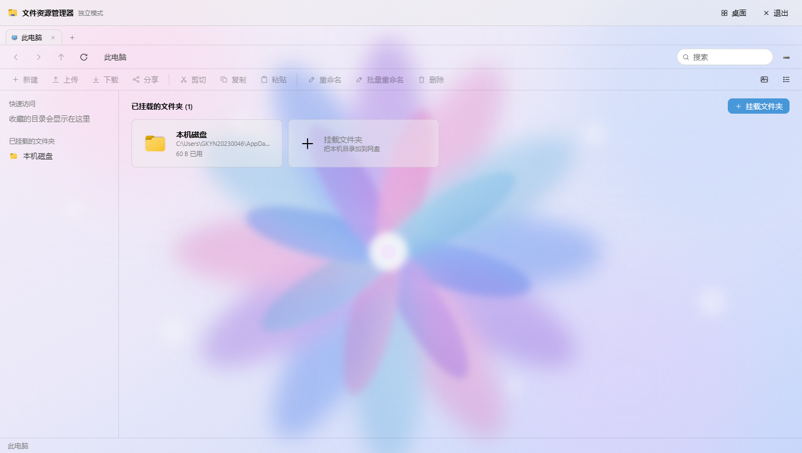
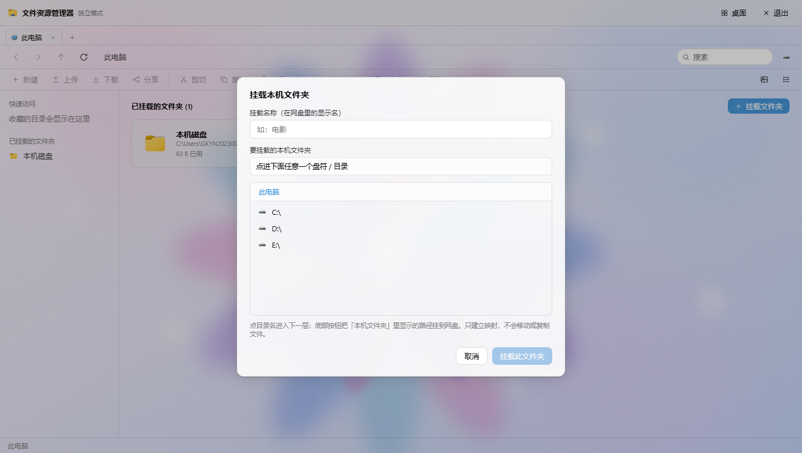
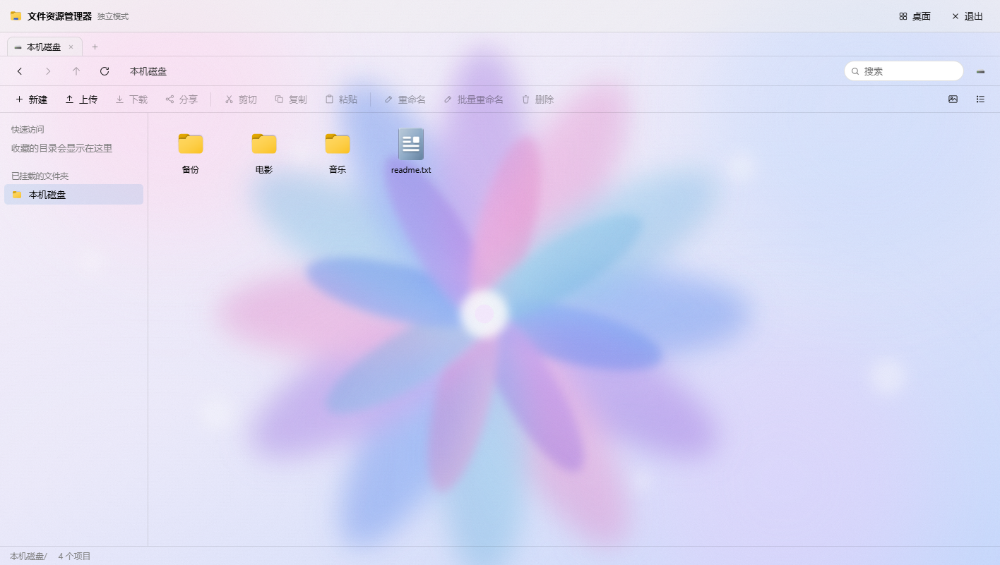

# CloudPan

**基于 [johngko/cloudpan](https://github.com/johngko/cloudpan) 修改的单用户私有网盘 —— Go + Vue，单文件部署**


---

## 这是什么

CloudPan 是一个用 **Go（Gin + GORM + SQLite）** 和 **Vue 3 + TypeScript + Vite** 写的私有网盘。前端构建产物通过 `go:embed` 打进 Go 二进制，**一个可执行文件就能跑** —— 不需要 Docker，不需要额外装数据库，也不依赖系统运行库。

本项目**基于 [johngko/cloudpan](https://github.com/johngko/cloudpan) 修改而来**，在此向原作者致谢。上游是一个功能完整的通用网盘；本仓库是在它基础上做减法得到的**个人自用版**。

## 面向对象

只面向一种场景：**在自己的机器上跑，给自己用。**

- **单用户**：只有 `admin` 一个账号，登录只输密码；没有注册、没有用户管理、没有权限分级
- **内网自用**：家里或办公室局域网访问，手机走 WebDAV
- **把本机文件夹挂进网盘**：文件本来就躺在你的硬盘上，网盘只是给它们一个界面和一个统一入口

**不适合**：多用户协作、团队共享、公网多租户服务、企业权限体系。这些不是"还没做"，而是**刻意不做**。本项目按 MIT 正常开源，但设计目标始终只有一个：个人自用。

## 我们的原则

上游是个大而全的项目，本分支只保留"自己用得上"的部分：

1. **自己用** —— 只解决一个人的问题，不为假想的需求写代码
2. **可控** —— 功能少而明确，出问题看得懂、修得动；不引入黑盒依赖
3. **不复杂** —— 能删的都删。多用户体系、游客登录、站内共享、云盘挂载、macOS / Deepin 主题，以及一批用不到的内置应用，均已整体移除

体现在具体选择上：存储策略**只剩"本机磁盘目录"一种**（云盘驱动整包删除）；回收站**永久保留、不自动清理**；任务阶段提示与失败原因**分成两个字段**。目标都是"少一点意外"。

## 功能

**桌面外壳**

- Windows 12 概念风格：开机动画 → 登录 → 桌面 → 可拖拽窗口 → 开始菜单 / 全局搜索 / 控制中心
- 深浅色主题、通知中心、传输浮窗（多任务并发，可暂停 / 继续 / 取消）、全局右键菜单
- 内置应用 11 个：文件资源管理器、此电脑、回收站、记事本、图片查看器、媒体播放器、媒体中心（可安装）、任务中心、应用中心、设置、管理控制台

**挂载本机文件夹（核心动线）**

- 文件管理器根视图**直接列出已挂载的文件夹**，不显示盘符
- 「挂载文件夹」对话框内嵌本机目录浏览器，整盘可翻，选中即挂载；右键可卸载
- 路径必须**绝对**且**已存在**，不存在会被拒绝，不会静默创建

**网盘核心**

- **上传**：分块上传 + 断点续传 + SHA-256 秒传（硬链接去重）
- **下载**：单文件直下；多选 / 目录 zip 流式打包；图片、视频、音频 Range 预览
- **分享**：提取码、有效期、下载次数、端到端加密分享
- **回收站**：还原 / 彻底删除 / 清空（永久保留，无自动清理）
- **其他**：zip 压缩解压、版本管理、缩略图、全局搜索、审计日志
- **离线下载**：HTTP(S) 直链、BT 磁力、m3u8（HLS）。服务器代下载入网盘，任务队列重启自动恢复，SSRF 三层防护
  - 任务可看**详情**（原始链接、保存位置、分片进度、失败原因）、可**重试**、可**删除**
  - 文件名可自定义；不填则自动命名 `YYYYMMDD_NN.mp4`（当天从 `_01` 递增），同名不覆盖
- **WebDAV**：**一个统一入口 `/dav/` 就是全部挂载**，不用一个个加；单个挂载也可单独挂 `/dav/<挂载名>/`
  - 使用**独立的 WebDAV 密码**（在「设置 → WebDAV 独立密码」里设置，与登录密码是两回事）
  - 手机端填：地址 `http://<本机内网IP>:18322/dav/`、账号 `admin`、密码＝那个独立密码
  - `/dav/` 是只读的索引层，要传文件请进到 `/dav/<挂载名>/` 里面

**管理控制台**：仪表盘、存储策略、任务监控、站点设置、审计日志

## 支持平台

**服务端**（跑 CloudPan 本体的那台机器）—— 纯 Go 实现，SQLite 用的是纯 Go 驱动，**不需要 CGO、不需要 GCC、不依赖系统库**，产出的是单个静态可执行文件：

| 平台 | 架构 | 状态 |
|---|---|---|
| Windows 10 / 11 | x64、ARM64 | ✅ 实测编译通过，x64 为本机主平台 |
| Linux | x64、ARM64、ARMv7 | ✅ 实测编译通过 |
| macOS | Intel、Apple Silicon | ✅ 实测编译通过 |

**客户端**（访问网盘）—— 任何能打开网页的设备都可以：

- **浏览器**：Windows / macOS / Linux / Android / iOS 上的现代浏览器
- **WebDAV 客户端**：把 `/dav/` 当网络位置挂载（Windows 资源管理器、macOS Finder、Android 的 Solid Explorer / FolderSync 等）

**关于 iPhone / iPad**：iOS 上**跑不了服务端** —— 系统不允许 App 在后台常驻并监听端口，这是平台本身的限制，换任何语言都一样。iOS 只能当客户端：

- Safari 打开 `http://<内网IP>:18322` 用网页版
- 或装一个支持 WebDAV 的 App（如 Documents、nPlayer）连 `/dav/`
- 注意：iOS 自带的「文件」App **不直接支持 WebDAV**，需要第三方 App

本项目只面向"在自己电脑上跑、给自己用"，不为 NAS、路由器、群晖等设备做专门适配。

## 构建与运行

**前置要求**

- **Go 1.27+**（`server/go.mod` 里写的是 `go 1.27.0`）
- **Node.js 18+**（只在构建前端时需要）
- 不需要 Docker，也不需要单独装数据库

> 前端产物是用 `go:embed` 打进二进制的，所以**必须先用 Node 构建一次前端**。
> 如果你 clone 下来直接 `go build`，能编过，但打开网页只会看到一句"前端资源未构建"。

**Windows**

```bat
build.bat      :: 构建前端 → 嵌入 → 装配出 out\ 交付目录
start.bat      :: 启动，浏览器访问 http://localhost:18322
```

**Linux / macOS**

```bash
./build.sh     # 构建前端 → 嵌入 → 装配出 out/ 交付目录
./start.sh     # 启动，浏览器访问 http://localhost:18322
```

构建完得到 `out/` 目录 —— **这就是要拿走的全部东西**，不用再从别处东拼西凑：

```
out/
├── cloudpan.exe       主程序（Linux/macOS 下是 cloudpan），前端已打进这一个文件
├── start.bat          启动脚本（Windows 双击）
├── start.sh           启动脚本（Linux/macOS）
├── README.txt         使用说明：数据在哪、怎么备份、怎么换端口
└── LICENSE            MIT 许可
```

把这个文件夹整个拷到目标机器就能跑，`data/` 会在第一次启动时自动生成在旁边。以后要重新构建，直接再跑一次脚本即可 —— **它不会删掉 `out/data/`**（那里可能已经是你真实的数据了）。

两个启动脚本都带可执行位，clone 下来直接跑即可。它们会先自己找到二进制所在目录再启动（源码树里找 `server/`，交付包里就在同级）—— 这一步不能省：数据目录默认取"当前工作目录下的 `./data`"，从别处启动会得到一套全新的空数据库，界面看起来就像"文件全没了"。

**交叉编译**（可选，给别的机器编，不用换机器）

```bash
cd server
CGO_ENABLED=0 GOOS=linux   GOARCH=amd64 go build -o cloudpan-linux-x64 .
CGO_ENABLED=0 GOOS=linux   GOARCH=arm64 go build -o cloudpan-linux-arm64 .
CGO_ENABLED=0 GOOS=darwin  GOARCH=arm64 go build -o cloudpan-macos-arm64 .
CGO_ENABLED=0 GOOS=windows GOARCH=amd64 go build -o cloudpan.exe .
```

`CGO_ENABLED=0` 是必须的 —— 它保证产出的是**静态**二进制，拷到别的机器直接跑，不挑系统库版本。编出来的文件直接覆盖 `out/` 里的主程序即可（Windows 下文件名必须是 `cloudpan.exe`，其他平台是 `cloudpan`），启动脚本会自己找到它。

**首次运行**

1. 浏览器打开 `http://localhost:18322`
2. 账号固定 `admin`；**初始密码在首次启动时随机生成，只打印一次到启动日志**，请立刻记下
3. 登录后在 **设置 → 账号** 修改密码
4. 打开文件管理器 → 右上角「**挂载文件夹**」→ 选一个本机文件夹 → 确认，回到根视图即可看到它

> **macOS 提示**：如果二进制是别人编好发给你的，第一次运行可能被 Gatekeeper 拦下，执行 `xattr -d com.apple.quarantine ./cloudpan` 解除即可；自己用 `./build.sh` 编的不会有这个问题。

**截图**

| 登录（只有密码框） | 桌面 |
|---|---|
|  |  |

| ① 根视图：直接列出挂载的文件夹，无盘符 | ② 挂载文件夹：内嵌本机目录浏览器 | ③ 进入挂载点：磁盘上的真实内容 |
|---|---|---|
|  |  |  |

## 常用配置

| 环境变量 | 默认值 | 说明 |
|---|---|---|
| `CP_PORT` | `18322` | 监听端口 |
| `CP_DATA` | `./data` | 数据目录。**建议设成绝对路径** |
| `CP_PUBLIC_URL` | `http://localhost:<端口>` | 对外可达地址 |
| `CP_TRUSTED_PROXIES` | 空 | 部署在反向代理之后时声明代理网段（逗号分隔 CIDR/IP）。默认**不信任任何** `X-Forwarded-For` |

- 数据目录默认跟着二进制走（源码树里是 `server/data/`，交付包里是 `out/data/`），里面有 `cloudpan.db`、`cloudpan.db-wal`、`cloudpan.db-shm`、`secret.key`、`recycle/`、`uploads/`、`thumbs/`。**备份请把这几样一起拷** —— 只拷 `cloudpan.db` 会丢掉最近的事务。最省心的做法是**把 `out/` 整个拷走**，程序和数据就都带上了
- **下载缓存的清理**：离线下载（直链 / BT / m3u8）的中间数据放在 `data/bt_tmp/`、`data/ziptmp/` 与系统临时目录（`%TEMP%` 或 `/tmp`）下的 `cp_offline_*.tmp`。任务完成、失败、取消、删除时都会清；程序启动时与每 6 小时还会**再清一次**，兜住上次异常退出（强杀 / 断电 / 崩溃）留下的残留。清扫只认程序自己的命名规则，**同一个字都不会碰你挂载目录里的文件**。若想手工腾地方，删掉 `data/bt_tmp/`、`data/ziptmp/` 里的内容即可（`ziptmp` 里 `m3u8-*`、`bt_tmp` 里纯数字目录都是可安全删除的缓存）
- **开机自启**：Windows 用 NSSM 注册成服务（`nssm install CloudPan <完整路径>\cloudpan.exe`，并在 `AppEnvironmentExtra` 里给 `CP_DATA` 一个绝对路径）；Linux 用 systemd，`Restart=always`
- **开发模式**：`cd web && npm install && npm run dev`（Vite 5173，`/api` 代理到 18322）；另开一个终端 `cd server && go run .`
- 历史改动记录见 [docs/CHANGELOG.md](docs/CHANGELOG.md)

## 许可与致谢

- 本项目**基于 [johngko/cloudpan](https://github.com/johngko/cloudpan) 修改**，沿用其 **MIT** 许可（见 [LICENSE](LICENSE)）。感谢原作者的开源
- 壁纸照片来自 Unsplash 免费授权
- Windows / Windows 11、12 是 Microsoft 的商标。本项目为独立实现，与 Microsoft 无任何关联
